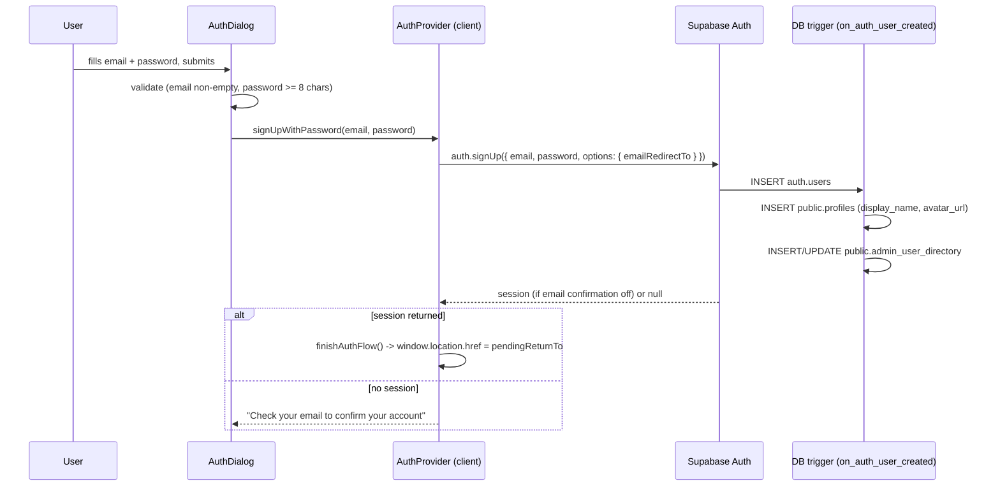
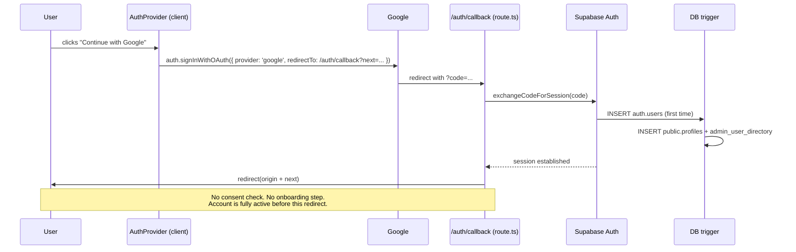
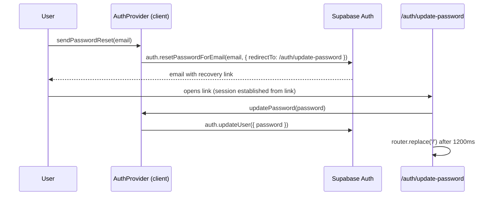
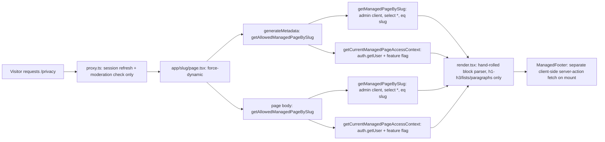

# Legal, Auth & Data-Flow Audit

Date: 2026-08-28
Branch: `feat/legal-auth-ux`
Scope: Prompt 01 of `prompt-packs/kissago_legal_ux_prompt_pack_2026-08-28/`

This is a factual implementation map, built by reading the code directly (not from the prompt pack's
assumptions). It is the basis for the auth/consent redesign and the Help & Legal centre that follow it.

---

## 1. Architecture summary

Kissago's authentication is entirely **client-side** — there are no auth server actions. `AuthProvider.tsx`
owns the Supabase browser client and every auth operation (sign-up, sign-in, OAuth, password reset/update,
sign-out). It renders a single shared `AuthDialog` component. The only server-side auth code is the OAuth
callback route (`app/auth/callback/route.ts`, 19 lines) and `proxy.ts`, and neither performs any consent or
age check today.

Legal content is served by a general-purpose CMS (`managed_pages`, migration 032) via the catch-all
`app/[slug]/page.tsx` route. It is `force-dynamic`, uncached, and calls the DB and Supabase Auth twice per
request (once for `generateMetadata`, once for the page body). Legal links surface only in the footer
(`ManagedFooter.tsx`), which itself is not rendered on any auth screen.

**There is no legal consent layer anywhere in the product.** No column, table, or UI element records
acceptance of anything. A minor can create an account with no age check at any layer.

---

## 2. File / component / schema map

### Auth
| Concern | File |
|---|---|
| Auth dialog UI | `components/auth/AuthDialog.tsx` |
| Auth state + operations | `components/auth/AuthProvider.tsx` |
| `useAuth()` hook | `lib/hooks/useAuth.ts` |
| Profile menu (signed-in) | `components/auth/UserMenu.tsx` |
| Signed-out landing | `components/auth/SignedOutScreen.tsx` |
| Restricted-account actions | `components/auth/RestrictedAccountActions.tsx` |
| OAuth callback | `app/auth/callback/route.ts` |
| Password recovery landing | `app/auth/update-password/page.tsx` |
| Middleware / session refresh + moderation gate | `proxy.ts`, `lib/supabase/middleware.ts`, `lib/supabase/user-moderation-middleware.ts` |
| Admin identity | `lib/supabase/admin.ts` (`verifyAdmin()`, single `ADMIN_USER_ID`) |
| Restricted-account screen | `app/account-restricted/page.tsx` |

### Legal / CMS
| Concern | File |
|---|---|
| Schema | `supabase/migrations/032_managed_pages.sql` (+ rollback) |
| Types | `lib/managed-pages/types.ts` |
| Seed registry (11 pages) | `lib/managed-pages/registry.ts` |
| Access predicates | `lib/managed-pages/access.ts` |
| DB I/O | `lib/managed-pages/service.ts` |
| Body renderer | `lib/managed-pages/render.tsx` |
| Server actions | `app/actions/managed-pages.ts` |
| Public route | `app/[slug]/page.tsx` |
| Admin editor | `components/admin/ManagedPagesSettings.tsx`, `app/admin/settings/pages/page.tsx` |
| Footer | `components/layout/ManagedFooter.tsx` |
| Richer (unused-by-legal) renderer | `lib/admin/manual-render.tsx` (admin manual only) |

### Identity schema (relevant columns only)
- `public.profiles` (`001_initial_schema.sql:9-14`): `id`, `display_name`, `avatar_url`, `created_at`. **No
  consent, age, DOB, or guardian column.**
- `public.viewer_profiles` (`091_viewer_profiles.sql`): household viewing profiles — `audience_mode`
  (`all`/`kids`), `age_band` (stored, never read). 0 rows in either environment; no UI creates them.
- `public.admin_user_directory` (`083`): service-role mirror of `auth.users` (email, display_name,
  last_sign_in_at). Not user-facing.
- `public.user_account_moderation` (`083`): `status` (`active`/`suspended`/`blocked`), reason, audit trail.

---

## 3. Auth flow diagrams

### Email/password sign-up

No consent checkpoint exists anywhere in this flow.

### Google OAuth (first-time user)

**This is the concrete evidence for stop condition 2**: the account row exists and the session is live
*before* `route.ts` line 13 runs. There is no interception point in this file today.

### Password reset

---

## 4. Current legal-content flow

Four DB/Auth round trips and one client-side follow-up fetch, for a page that in 9 of 11 cases is
`accessLevel: 'public'` and needs none of the auth check to render. No `loading.tsx` exists, so the browser
sits on the previous page with no feedback until the entire render completes.

---

## 5. Data & vendor inventory

### Vendors actually wired into code

| Category | Service | Evidence |
|---|---|---|
| Database / Auth / Storage | Supabase | `lib/supabase/*`, `NEXT_PUBLIC_SUPABASE_URL`, `SUPABASE_SERVICE_ROLE_KEY` |
| Identity provider | Google (via Supabase OAuth) | `AuthProvider.tsx:131-142` |
| Hosting + cron | Vercel | `vercel.json`, daily `/api/batch/reconcile` |
| Object storage / CDN | Cloudflare R2 | `lib/media/r2-server.ts`, `R2_*` env vars |
| AI text | Google Gemini | `app/actions/gemini-proxy.ts`, `GEMINI_API_KEY` |
| AI images | Gemini, OpenAI, xAI, Runware | `lib/ai/image-providers/*` |
| AI narration | ElevenLabs (primary), Gemini TTS (fallback) | `app/actions/narration.ts` |
| AI video | **none** — client-side ffmpeg.wasm/mediabunny only | `lib/hooks/useVideoExport.ts` |
| Payments | Razorpay | `lib/billing/razorpay.ts`, `app/api/billing/razorpay/*` |
| Payments (schema only, unused) | Stripe | CHECK constraints in migrations 016/019; no SDK, no keys |
| Email | Supabase Auth transactional mail only | no SendGrid/Resend/Postmark |
| Analytics | **none** | no PostHog/GA/Segment/Mixpanel |
| Error monitoring | **none** | only `console.error`, captured by Vercel runtime logs |
| Moderation service | **none** | Runware's `NSFWContent` flag is captured but unused; admin `moderationRequiredForPublic` defaults off |

### Data categories (from `supabase/migrations/*.sql`, 98 files)

| Category | Representative tables |
|---|---|
| Identity/account | `profiles`, `admin_user_directory`, `viewer_profiles`, `user_entitlement_overrides` |
| Stories/beats/characters | `stories`, `beats`, `beat_revisions`, `story_bibles`, `character_masters`, `episode_branches` |
| Generated media | `media_assets`, `image_generation_jobs`, `narration_batch_jobs` |
| User uploads/references | `reference_sources`, `reference_adoptions` |
| Public/shared content | `storylines`, `storyline_beats`, `managed_pages` |
| Subscriptions/coins/payments | `pricing_plans`, `billing_customers`, `billing_subscriptions`, `billing_orders`, `billing_webhook_events`, `beat_grants` |
| Analytics/cost telemetry | `ai_cost_events`, `narration_generation_logs`, `model_config_history` |
| Engagement | `storyline_likes`, `storyline_views`, `storyline_progress`, `saved_storylines` |
| Moderation/safety | `user_account_moderation`, `admin_user_audit_events`, `operational_policy_audit_events` |
| Support messages | **none** — mailto to `SUPPORT_EMAIL` only |
| Session/device/IP logs | **none in `public` schema** |
| Notification tokens | **none** |

**Notable exposure points:** `profiles` is world-readable under RLS. `billing_orders.raw_provider_payload_json`
and `billing_webhook_events.payload_json` store raw Razorpay payloads verbatim. No table stores IP addresses,
user agents, or device fingerprints anywhere.

### Retention / deletion

- **No self-serve account deletion.** Confirmed by the seed content itself (`registry.ts:80,318,363`).
- User-initiated story deletion (`app/actions/persistence.ts:2557`) removes the DB row only — **media in
  Supabase Storage and Cloudflare R2 is not removed**.
- Admin story deletion also removes Supabase Storage objects, but **not R2 objects**.
- The only real retention schedule: HQ media originals expire by plan — Free 24h, Plus 10 days, Studio 30
  days (`lib/media/retention.ts`). Display/thumbnail/share variants are kept indefinitely.
- `ai_cost_events`, `narration_generation_logs`, `billing_webhook_events`, `storyline_views`, and the audit
  tables have **no TTL** — they grow indefinitely.
- Abandoned reference uploads (`story_id IS NULL`, >48h) are purged.
- Extensive `ON DELETE CASCADE` from `auth.users` covers most user data on account deletion (were one to
  exist); some tables use `ON DELETE SET NULL` instead (`ai_cost_events`, `media_assets.user_id`), so
  telemetry rows survive de-linked from the user.

---

## 6. Child/minor account findings

**A minor can independently create a Kissago account today, with no restriction of any kind:**

1. `AuthDialog.tsx` validates only email presence, password length (≥8), and password match on sign-up. No
   age field, no DOB field, no age-related copy exists anywhere in the component.
2. `AuthProvider.signUpWithPassword` (`:154-172`) passes `{ email, password, options: { emailRedirectTo } }`
   to Supabase — no `options.data` metadata is sent, so age could not even be recorded if it were collected.
3. Google OAuth provisions a full account via `exchangeCodeForSession` with zero interception surface.
4. The `on_auth_user_created` trigger inserts a `profiles` row unconditionally for every new `auth.users` row.
5. `proxy.ts` gates only on moderation status (`suspended`/`blocked`), never on age.
6. `/gallery/kids` is a fully public URL requiring no account, no PIN, and no verification of any kind — it
   only narrows the *content* shown (`storylines.age_group` filter), not who may view it.
7. `viewer_profiles.age_band` is a schema column that exists but is **written nowhere and read nowhere** —
   it carries no enforcement today.

**Recommended default (per the pack, and what this implementation adopts):** account holders are adults
(18+); children use Kissago under a parent/guardian/educator's account. This is a **policy and copy change**,
not an age-verification system — no age-assurance or verifiable-parental-consent architecture is built as
part of this pack. That gap is recorded in `docs/agent-context/PROJECT_STATE.md` as a deliberate deferral,
not an oversight.

---

## 7. AI-generated-content findings

- **Text**: Google Gemini generates story beats, choices, and continuity notes (`app/actions/gemini-proxy.ts`,
  `lib/ai/beat-orchestration.ts`).
- **Images**: routed across Gemini, OpenAI, xAI, and Runware (`lib/ai/image-providers/router.ts`).
- **Audio**: ElevenLabs primary, Gemini TTS fallback.
- **Video**: rendered entirely client-side (ffmpeg.wasm / mediabunny) — no AI video vendor is involved.
- **Provenance/labelling**: no C2PA, no SynthID, no EXIF provenance (EXIF is actively stripped from uploads
  via `sharp` re-encoding). The only watermark in the system is a **Kissago brand watermark** on video
  exports, plan-gated — it is not an AI-provenance mark. No asset carries an "AI-generated" label.
- **Third-party retention**: `store: true` is set on both the OpenAI Responses API image call
  (`lib/ai/image-providers/openai-provider.ts:179`) and the Gemini `interactions.create` image call
  (`app/actions/gemini-proxy.ts:540`), to support stateful multi-turn image continuity. This means those
  providers are asked to retain the request/response server-side. **No zero-data-retention or no-train
  configuration is set with any provider.** This is a decision point for the Privacy Notice — flagged for
  the product owner, not resolved in this document.
- **Training**: Kissago does not train or fine-tune any model on user content. Verified — no training,
  fine-tuning, embedding-export, or dataset-export code exists anywhere in the repo.
- **Public sharing / moderation**: publishing to the public gallery has **no pre-publish moderation queue**
  (the `moderationRequiredForPublic` flag defaults off), **no user report/flag flow**, and **no automated
  safety filter** beyond a Runware `NSFWContent` flag that is captured but not acted on. Admin unpublish/
  delete does exist and is the only real moderation capability today.

---

## 8. Risks / blockers

Ranked by what blocks safe rollout of the consent gate:

1. **Google OAuth has no consent interception point.** Must be added before `legal_consent_gate_enabled` can
   safely go on for OAuth users (Phase 6e of the implementation plan).
2. **`app/auth/callback/route.ts` has an open-redirect**: `next` is taken verbatim from the query string and
   concatenated onto `origin` with no validation. Fixed alongside the OAuth gate (Phase 6e).
3. **Suspended/blocked users cannot reach legal pages** — `proxy.ts`'s `allowedWhileRestricted` list excludes
   `/help-legal` and the legal slugs. Fixed in Phase 4.
4. **No versioning exists on `managed_pages`** — a prerequisite for any consent record to mean anything.
   Fixed by migration 099 (Phase 5).
5. **`force-dynamic` + duplicate fetches** make every legal-page view expensive; this is the direct cause of
   the "did my click register" UX complaint. Fixed in Phase 3.
6. **No account-deletion mechanism** — the Privacy Notice cannot promise what the product cannot perform.
   Recorded as a known gap for Phase 7 content, not built in this pack.

---

## 9. Implementation recommendations (carried into the plan)

1. Keep `managed_pages` as the CMS; add versioning columns and an append-only `managed_page_versions` table
   rather than migrating to static files, per product-owner decision.
2. Fix the CMS performance problem at its actual causes: drop `force-dynamic`, dedupe the double fetch with
   React `cache()`, skip the auth round trip for public pages, and add `loading.tsx`.
3. Build the consent gate as two migrations (099 schema, 100 acceptance ledger) behind a feature flag
   (`legal_consent_gate_enabled`, seeded off), following the existing fail-closed/fail-open patterns already
   used by `getFeatureFlag` and `loadModerationForMiddleware`.
4. Reuse `components/ui/Sheet.tsx`'s mechanics (portal, focus trap, scroll lock) for both the redesigned
   `AuthDialog` and a new desktop `Modal`, rather than re-deriving accessibility primitives.
5. Reuse `lib/admin/manual-render.tsx`'s inline-formatting logic (bold, links, inline code) as the basis for
   an extended `lib/managed-pages/render.tsx`, preserving the deliberate "React text nodes only, no
   `dangerouslySetInnerHTML`" property.
6. Do not publish any seed content containing a bracketed placeholder. Everything unresolved stays listed
   below and the corresponding page stays at `requires_acceptance = false`.

---

## 10. UNVERIFIED LEGAL FACTS — RESOLVED 2026-08-29

All 15 facts below were supplied by the product owner and are now recorded in `lib/legal/business-config.ts`,
the single source of truth the Phase 7 seed content (`lib/managed-pages/registry.ts`) interpolates from:

1. Legal entity name — **Aavriti Design Studio**, a partnership firm registered in India (GSTIN
   `24ACLFA8196N1ZN`).
2. Registered/business address — B601, Kunj Heights, Vavol, Gandhinagar, Gujarat 382016, India.
3. Country + state/city of registration — India, Gujarat, Gandhinagar.
4. Governing jurisdiction and courts — laws of India; courts at Gandhinagar, Gujarat.
5. Support email — `support@kissago.cc` (unchanged env-driven `SUPPORT_EMAIL`).
6. Legal/notices email — `legal@kissago.cc`.
7. Privacy contact email — `privacy@kissago.cc`.
8. Security/account-compromise email — `security@kissago.cc`.
9. Grievance Officer — Rajeev Kumar, Partner & Grievance Officer.
10. Grievance email — `grievance@kissago.cc`.
11. Effective date for v1.0.0 of all four documents — 2026-08-29.
12. Appeal/report channel — email, `report@kissago.cc` (no in-app form yet; not invented).
13. Rights/copyright complaint contact — `copyright@kissago.cc`.
14. Markets actively targeted — India initial rollout, international expansion planned; the rewritten notices
    avoid both an India-only claim and any GDPR/CCPA/COPPA-specific compliance claim.
15. Account-holder minimum age — confirmed 18. Real age assurance / verifiable parental consent remain
    deferred (see `PROJECT_STATE.md`); this is a policy statement, not a technical age gate.

The two product decisions are also resolved:

- **`store: true` retention on the OpenAI and Gemini image calls is disclosed as-is** in the Privacy & Data
  Notice, rather than changed — the owner's explicit choice, since disabling it would break cross-beat visual
  continuity.
- **No self-serve account deletion** is stated plainly rather than promised; deletion requests route to
  support/privacy email for manual handling, consistent with what the product can actually do.

Nothing in the four rewritten documents contains a bracketed placeholder
(`lib/managed-pages/registry.legal-content.test.ts` asserts this in CI). The remaining step is owner-only: the
new seed content must be pulled into each live `managed_pages` row and published through the admin workflow
after migrations 099/100 are applied — see the Phase 7 section of `PROJECT_STATE.md` for the exact steps.
