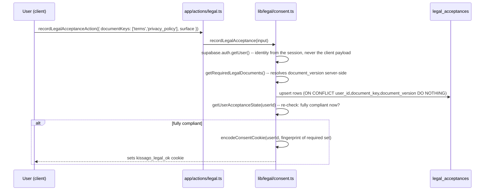

# Legal Consent, Versioning & Re-consent Model

Date: 2026-08-28
Branch: `feat/legal-auth-ux`
Scope: Prompt 04 of `prompt-packs/kissago_legal_ux_prompt_pack_2026-08-28/`

This describes the schema, API flow, and versioning/re-consent logic added in Phase 5 of the legal/auth UX
pack. Nothing here is user-facing yet — the checkbox UI, OAuth gate, and legal document modal are Phase 6.
The gate itself is behind `legal_consent_gate_enabled` (seeded off).

---

## Separate concepts, not one boolean

Per the pack, contract acceptance, notice acknowledgement, and optional consent are distinct events and are
never collapsed into a single flag:

- **Contract acceptance** (`acceptance_type: 'accepted'`) — Terms of Service & EULA. An affirmative act.
- **Notice acknowledgement** (`acceptance_type: 'acknowledged'`) — Privacy & Data Notice. Evidence the notice
  was presented, not a separate "I consent" click.
- **Optional consent** (marketing, optional analytics, training use of private content) — out of scope for
  this pack; nothing here should be read as covering it. If such a flow is built later, it needs its own
  table — never folded into `legal_acceptances`.
- **Parental/guardian consent** — not built. See "What this does not do" below.

`managed_pages.acceptance_kind` declares which of the first two a given document is; `legal_acceptances`
records which one actually happened.

---

## Schema

### `managed_pages` (migration 099 adds six columns to the existing table)

| Column | Type | Meaning |
|---|---|---|
| `doc_version` | `TEXT NULL` | Semantic version shown to users and stored in acceptance rows. `NULL` = unversioned page. |
| `effective_date` | `DATE NULL` | Displayed date; not itself the gating mechanism. |
| `requires_acceptance` | `BOOLEAN NOT NULL DEFAULT false` | Whether this document is part of the required set the gate checks. |
| `acceptance_kind` | `TEXT NULL CHECK IN ('accepted','acknowledged')` | Which of the two concepts above this document represents. |
| `reacceptance_required` | `BOOLEAN NOT NULL DEFAULT false` | Set by publishing a **material** version; cleared by publishing a **minor** one. |
| `published_at` | `TIMESTAMPTZ NULL` | When the current `doc_version` was published. |

### `managed_page_versions` (migration 099, new table)

Append-only snapshot, one row per published version: `page_key`, `doc_version`, `title`, `content`,
`excerpt`, `effective_date`, `change_type` (`minor`/`material`), `published_at`, `published_by`.
`UNIQUE(page_key, doc_version)` — republishing the same version number is rejected rather than silently
overwriting history, since an acceptance row points at a `doc_version` and the exact text must stay
retrievable.

### `legal_acceptances` (migration 100, new table)

| Column | Type | Meaning |
|---|---|---|
| `user_id` | `UUID` → `auth.users` | |
| `document_key` | `TEXT` | `managed_pages.page_key`. |
| `document_version` | `TEXT` | Resolved server-side at write time — never taken from the client. |
| `acceptance_type` | `'accepted' \| 'acknowledged'` | Copied from the document's `acceptance_kind` at the moment of acceptance. |
| `surface` | `'email_signup' \| 'oauth_onboarding' \| 'reconsent_modal' \| 'admin_backfill'` | Where the acceptance happened. |
| `locale`, `app_build` | nullable | Not currently populated — no build-id concept exists in this app yet. |
| `accepted_at` | `TIMESTAMPTZ NOT NULL DEFAULT NOW()` | Server timestamp. |

`UNIQUE(user_id, document_key, document_version)` makes repeated writes idempotent. **No `ip_address` or
`user_agent` column** — the pack's guidance is not to duplicate network identifiers into contract evidence
without a verified need, and no table in this schema stores them today.

Both tables: RLS enabled, no end-user policies (service-role only), matching the ~40 other admin-config
tables in this schema. Reads happen through the service-role loaders in `lib/legal/consent.ts`; writes only
after identity is established server-side.

---

## API flow

`recordLegalAcceptance` is the **only** write path to `legal_acceptances`. It never trusts a client-supplied
version string — the version comes from `getRequiredLegalDocuments()`, which reads `managed_pages` directly.
A client can say *which* documents it's accepting; it cannot say *at what version*.

### The gate (`proxy.ts`, via `lib/legal/consent-middleware.ts`)

Runs only for a signed-in, non-admin, non-restricted user, on a route that isn't `/auth/*`, `/signed-out`,
`/account-restricted`, `/api/*`, or a legal slug:

1. `legal_consent_gate_enabled` off → inert (default state today).
2. No documents have `requires_acceptance = true` → inert.
3. A valid `kissago_legal_ok` cookie whose embedded fingerprint matches the current required set → inert,
   no DB read.
4. Otherwise, a live check against `legal_acceptances`. Non-compliant → redirect to
   `/auth/accept-terms?next=<path>`. Compliant → the cookie is (re)written so the next request skips the DB.

**Fails open** on any missing config, non-OK response, or exception, matching the existing moderation check's
established pattern (`lib/supabase/user-moderation-middleware.ts`) — a database blip or an un-applied
migration must never lock a signed-in user out of the product.

### The cookie is a cache, never the record

`kissago_legal_ok` encodes `{ userId, fingerprint }`, HMAC-signed with `LEGAL_CONSENT_COOKIE_SECRET`
(`lib/legal/consent-cookie.ts`). The fingerprint is a stable, order-independent hash of every
`(document_key, document_version)` pair currently required
(`buildAcceptanceFingerprint`) — not a per-user value. Consequence: publishing a new required version changes
the fingerprint for everyone at once, so every existing cookie stops matching without touching a single user
row. The row in `legal_acceptances` is the evidence; the cookie only saves a query when it's still valid. If
`LEGAL_CONSENT_COOKIE_SECRET` is unset, the cookie is simply never written or checked — the gate still works,
just without the fast path.

---

## Version manifest & the minor/material distinction

Defined per-document by the admin editor (`components/admin/ManagedPagesSettings.tsx`) and enforced by
`lib/managed-pages/versioning.ts`:

- **Draft fields** (`doc_version`, `effective_date`, `requires_acceptance`, `acceptance_kind`) save through
  the normal Save button, same as title/content/excerpt.
- **Publishing** is a distinct action from saving, so an admin can iterate on content before committing a
  version to the acceptance ledger. `publishManagedPageVersion(pageKey, changeType, publishedBy)`:
  1. reads the **currently saved** row (not any unsaved draft — the admin UI disables Publish while there are
     unsaved changes, so this can't silently snapshot stale content);
  2. requires `doc_version` and `acceptance_kind` to already be set;
  3. inserts an append-only `managed_page_versions` snapshot;
  4. stamps `published_at`, and sets `reacceptance_required = (changeType === 'material')`.

Example policy the UI encodes but does not enforce mechanically (an admin judgment call, per document):
typo/contact-info/formatting update → **minor** (no re-acceptance); a change to user obligations, content
licence, subscription terms, dispute process, AI use of content, the account/child model, or data purpose →
**material** (re-acceptance required).

---

## Re-consent experience (data-layer side; UI is Phase 6)

When a **material** version is published, `reacceptance_required` flips true and the required-set fingerprint
changes. Every signed-in user whose `legal_acceptances` rows don't cover the new version now fails the live
check on their next non-exempt request and is routed to `/auth/accept-terms`. There is no countdown, no
skip, and no way to dismiss the gate short of accepting — enforced by the gate itself having no bypass path,
not by UI convention alone.

A **minor** version does not set `reacceptance_required`; existing users' acceptance of the prior version
continues to satisfy the gate. Only new sign-ups and anyone not yet compliant would be recording the new
`doc_version` going forward.

---

## Fail-closed behaviour on a database without migrations 099/100

Per `docs/agent-context/PROJECT_STATE.md`, migrations are applied by hand and independently per environment.
`lib/legal/consent.ts` and `lib/legal/consent-middleware.ts` detect `42P01` (undefined table),
`42703`/`PGRST200`/`PGRST204` (undefined column) and latch a dedicated "legal schema unavailable" flag —
**never reusing the gallery's discovery/series latches**, per the documented rule that doing so fails an
unrelated surface closed for the wrong reason. Once latched:

- `getRequiredLegalDocuments()` returns `[]` (nothing gates).
- `getUserAcceptanceState()` treats everyone as compliant (nothing to satisfy).
- `recordLegalAcceptance()` no-ops (logs a warning, doesn't throw) rather than 500ing a sign-up.
- The gate stays inert.

A database with the migrations applied but the flag off behaves identically to one without the migrations at
all, by design — the flag is the actual on/off switch; the migrations only make turning it on *possible*.

---

## Tests

`lib/legal/consent-cookie.test.ts` (10 tests, pure — no DB, no `server-only`):

- fingerprint order-independence and version-sensitivity;
- a validly signed cookie round-trips;
- rejects: wrong user, stale fingerprint (simulating a newly published version), a tampered signature, a
  cookie signed with a different secret, and malformed values — none of these throw;
- **caught a real bug during development**: the original 3-field `userId.fingerprint.signature` cookie
  format broke on any semantic version containing a dot (e.g. `1.0.0`), since the naive split couldn't tell
  a version's internal dots from the field separators. Fixed by JSON-encoding the payload as one
  base64url-opaque segment before the signature, so only the *last* dot is meaningful.
- never signs when `LEGAL_CONSENT_COOKIE_SECRET` is unset, confirming callers fall through to a live DB
  check rather than failing.

Further tests (version-comparison/re-consent decision logic, the OAuth callback's `next` allow-list, and the
missing-migration latch integration) are planned for Phase 8 per the implementation plan, once Phase 6's UI
exists to exercise them end-to-end.

---

## What this does not do

- **No age assurance or verifiable parental consent.** A minor can still create an account today; this pack
  adopts the adult-account-holder policy as a copy/Terms change, not an age-verification system. Recorded as
  a deliberate deferral in `docs/agent-context/PROJECT_STATE.md`.
- **No optional-consent (marketing/analytics/training) flow.** Not needed by the current product, and
  building one prematurely would risk exactly the "bundled consent" anti-pattern the pack warns against.
- **No IP/device/fingerprint collection was added anywhere in this pack.**
