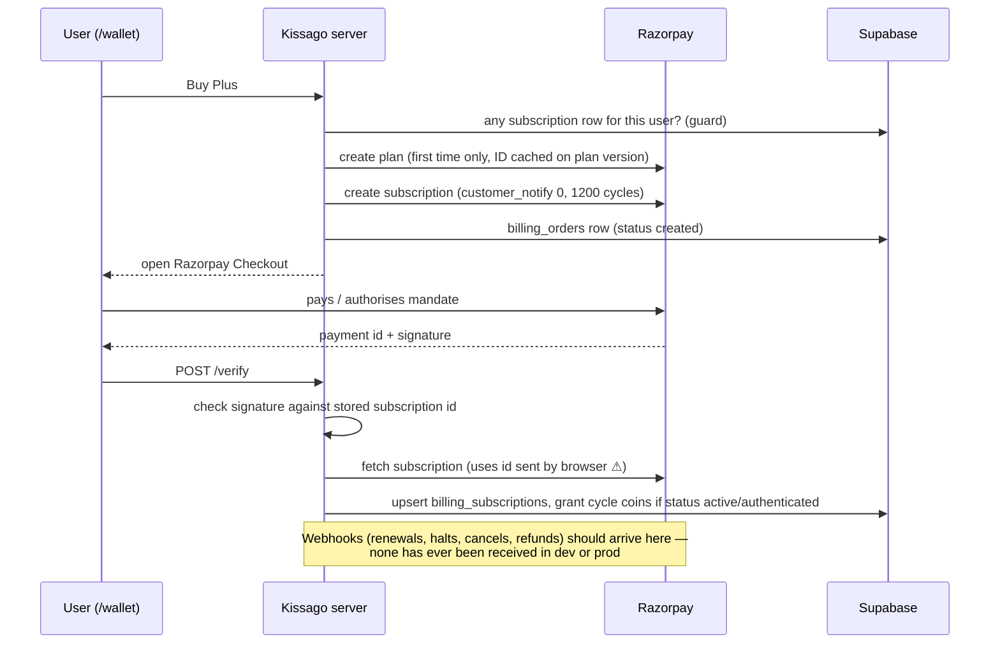

# Kissago payments & billing — current-state audit

_2026-09-17 · branch `payments` · audit only, nothing changed in code, schema, flags or config_

**Who this is for:** the owner deciding what to build before taking real money, and any later session that implements it. Evidence and full detail live in [research/](research/). This document consolidates it and is reviewer-checked: every item marked **verified** was confirmed by reading the code or querying the database, not taken from an agent report.

Companion document: `billing-plan-2026-09-17.md` (suggested plan, written after the Razorpay and India-compliance research lands).

---

## 1. Bottom line

1. **The happy path works in sandbox, but only half of the system has ever run.** Every coin credited so far came from the browser telling the server "payment done". Razorpay's server-to-server webhooks have **never been received in either environment**, so renewals, failed renewals, cancellations, refunds and disputes have never been processed. The one dev subscription has sat at a period end of 8 May 2026 ever since.
2. **There are money-correctness bugs that must be fixed before live payments.** Coins can be granted twice for one payment. A webhook that fails once is never retried. Payment confirmation can be pointed at the wrong subscription. The "turn checkout off" switch only hides buttons.
3. **There is no billing area for users.** No purchase history, no invoices or receipts, no manage/cancel subscription, no change plan. No billing emails are sent, and Razorpay's own notifications are switched off.
4. **Admins can't handle money problems without SQL.** They can't refund, cancel, see a user's payments or take coins back, and blocking a user leaves their subscription charging.
5. **Invoices need new data, not just new screens.** There are no tables for invoices, tax, billing address, refunds or payment methods, and the app collects no billing identity (name, state, GSTIN).
6. **Two pages stand between you and Razorpay live activation.** The public refund policy still reads "Starter Draft", and there is no shipping/delivery policy.
7. **The foundations are sound.** Signature checks, server-side prices, the coin spend engine, pricing versioning with an audit trail, and dev/prod schema parity are all in good shape. This is a finish-and-harden job, not a rewrite.

---

## 2. How money moves today

### Plans, coins and the owner's model

- Users see **coins**. Internally the unit is the **beat**, and 1 beat = 10 coins (`lib/types/pricing.ts`).
- A **subscription** (Free / Plus / Studio) grants a fixed number of coins **each billing cycle**. Those coins expire at cycle end. Unused coins do **not** roll over: the rollover grant type exists in the schema and flags, but nothing creates it.
- **Top-up packs** are one-time purchases. Their coins **never expire**.
- **Free users** get a 50-coin welcome grant, safe against double-granting (advisory lock). Free users cannot generate storyboard images without coins.
- **Spending order:** promotional → subscription → top-up. Spending runs through reserve → finalize/release in SQL with row locks and CHECK constraints, so balances cannot go negative. **Verified by stream 02; this part is solid.**
- **No single "1 coin = ₹X" rate exists.** Each plan and pack has its own admin-entered price, so the effective coin price is whatever those prices imply (see §5, pricing).

### Subscription purchase (as built)

### Top-up purchase (as built)

The server creates a Razorpay **Order** at the database price and the browser opens Checkout. On success the browser posts to `/verify`, where the signature is checked and coins are granted **on the signature alone** (no capture check). The `payment.captured` and `order.paid` webhooks would grant too, protected only by a check-then-insert.

### Renewals

These depend **entirely** on the `subscription.charged` webhook. Nothing polls Razorpay, and the daily cron (`/api/batch/reconcile`) only handles media and agent jobs. If a renewal webhook is missed or fails, the user is charged and gets no coins, and nothing notices.

---

## 3. What exists vs. what's missing

| Area | Exists | Missing |
|---|---|---|
| **Checkout** | `/wallet` page reachable signed-out (buttons say "Sign in"); Razorpay Standard Checkout for monthly subscriptions and top-ups; India-only beta gate; server-side prices; correct timing-safe signature checks | Annual plans (blocked in code); plan change; auto-renew and tax disclosure at purchase; server-enforced kill switch; `/pricing` marketing page |
| **Coin economy** | Grants, reservations, per-action costs, image-model pricing, tier gates, welcome grant, admin tier overrides | Grant idempotency in the database; clawback; rollover; coin amount snapshotted at purchase time |
| **User billing area** | Wallet balance, plan cards, a renewal-attention message | Purchase history, invoices/receipts, manage/cancel subscription, update payment method, retry failed payment, billing details (name/state/GSTIN) |
| **Notifications** | Supabase Auth emails only | Any transactional email; Razorpay subscription notifications are off (`customer_notify: 0`) |
| **Admin** | Pricing Studio (draft/publish/archive, full audit trail); manual coin grants (positive only); promotional cohorts; tier overrides; block/suspend; recovery tools that re-sync one subscription or top-up by Razorpay ID (labelled "internal testing"); AI cost dashboard | Refund; cancel subscription; view a user's orders/subscriptions/webhooks; deduct coins; revenue and margin; billing role separate from full admin |
| **Webhooks** | Signed, raw-body verified, events logged to `billing_webhook_events` | Ever being configured or received; retry of failed events; refund/dispute handling; alerting |
| **Data model** | `billing_customers`, `billing_subscriptions`, `billing_orders`, `billing_webhook_events`; provider-agnostic `provider` / `provider_price_ref` columns (a head start for Stripe) | Invoices, invoice numbering, tax lines, billing address, refunds, payment methods, retention-safe deletion |
| **Compliance pages** | Terms, Privacy, AI disclosure, Safety/Grievance, all published and versioned with a consent gate | Final refund & cancellation policy (draft is live); shipping/delivery policy; copyright and account-deletion pages still drafts |
| **Stripe** | Market routing in config only | No SDK, no checkout, no webhook |

---

## 4. Environment state (queried 2026-09-17)

| | Dev | Prod |
|---|---|---|
| Schema | through migration 123 | through migration 123 — **identical** |
| `pricing_checkout_enabled` | **on** | off |
| Hard enforcement, shadow metering, snapshot, admin bypass | on | off |
| Billing rows | 12 orders (8 abandoned subscription checkouts, 1 active subscription, 1 paid and 2 abandoned top-ups); 1 subscription grant, 1 top-up grant | **0 in every billing table** |
| Webhook events ever received | **0** | **0** |
| India Plus plan | ₹850 → 120 coins/month | ₹1,450 → 300 coins/month |
| India Studio plan | ₹3,950 → 900 coins/month | ₹3,950 → 900 coins/month |
| India top-ups | 120 (₹450), 240 (₹850) | 120 (₹450), 240 (₹850), 480 (₹1,650) |
| International catalog | Studio monthly/annual, Plus annual, 3 top-ups | Plus and Studio monthly/annual, no top-ups |
| Coin spending recorded | yes (enforcement on) | none — 23 free grants, 115 coins issued, 0 spent (metering off) |

Production is dormant exactly as the July rollout intended. Dev is ahead, which is normal here. The catalog **content** differs between the two, though, and there is no tool to promote one to the other.

---

## 5. Findings

Severity is about taking **live money**: **Blocker** = fix before the first real payment. All items are verified unless marked _pending_ (waiting on the Razorpay or India-compliance research). Source notes: C = checkout (01), E = entitlements (02), D = data (03), A = admin (04), P = policy/docs (05), R = reviewer.

### 5.1 Blockers

| # | Finding | What goes wrong | Where | Source |
|---|---|---|---|---|
| **B1** | **Webhooks have never been received.** The endpoint was probably never registered in the Razorpay dashboard, and nothing else checks Razorpay periodically. A missing webhook secret crashes the route before anything is logged. | Month 2: card charged, no coins, subscription status frozen. Refunds, halts and cancellations are invisible. | `app/api/billing/razorpay/webhook/route.ts`; `vercel.json` (only cron is media/agents) | C-F2, D-B1, R |
| **B2** | **A failed webhook is never retried.** The duplicate check ignores whether the stored event failed. | A transient DB error on a renewal → Razorpay retries → answered "duplicate" → coins lost silently. | `webhook/route.ts:46-57` | R, A-F4 |
| **B3** | **Coins can be granted twice for one payment.** The grant is check-then-insert with no unique constraint, and the browser's verify call and Razorpay's webhook race each other. | User pays ₹850 once and receives 240 coins twice. | `lib/billing/razorpay-sync.ts:128-230`; `beat_grants` has no unique index (both envs) | C-F1, D-B9, R |
| **B4** | **Subscription verify syncs a subscription ID sent by the browser**, not the one whose signature it just checked. Sync also rewrites the row's owner. | A user with one valid signature attaches another subscription ID → that subscription is reassigned to them and its coins granted again. | `app/api/billing/razorpay/verify/route.ts:59-83`; `razorpay-sync.ts:65-83` | R |
| **B5** | **The checkout kill switch only hides buttons.** The server never reads `pricing_checkout_enabled`. | Checkout "off" in an incident, yet direct calls still create real orders and subscriptions. | `app/actions/pricing-checkout.ts` (checks only the India-beta flag) | C-F3, R |
| **B6** | **No refund, cancellation or dispute handling anywhere:** no Razorpay wrapper, no admin action, no user action, no webhook handling, no coin clawback. | "Cancel my plan", "refund me" and chargebacks can only be handled in the Razorpay dashboard, and Kissago's records and coins then disagree with reality. | `lib/billing/razorpay.ts` (create/fetch only); `webhook/route.ts:247-261` | A-F1, E-R-4, C-F5 |
| **B7** | **Sandbox plan IDs are cached in the catalog.** A Razorpay plan ID is created once per plan version and reused forever. | Switch to live keys → every subscription checkout fails until those IDs are cleared. Two simultaneous first checkouts also create duplicate Razorpay plans. | `pricing-checkout.ts:272-306` | R, C |
| **B8** | **The refund & cancellation policy page is an unpublished draft that says so**, and there is no shipping/delivery policy. Razorpay reviews both at live activation. | Activation delayed or refused; weak position in disputes. | `managed_pages.refund_policy` (both envs); `lib/managed-pages/registry.ts:302-334` | P-S5-1, P-S5-3, R |

### 5.2 High

| # | Finding | What goes wrong | Where | Source |
|---|---|---|---|---|
| H1 | **Payers get no notification of any kind.** Razorpay subscription notifications are off and the app has no email provider. _Pending: RBI pre-debit notice obligations (streams 06/07) may make this a blocker._ | Renewal charges show up only on the card statement → chargebacks, complaints. | `lib/billing/razorpay.ts:110`; `package.json` has no email provider | P-S5-2, P-S5-10, R |
| H2 | **A user can end up with two live subscriptions.** The one-subscription guard only sees subscriptions already synced, not checkouts in progress. | Two tabs or a retry → two recurring charges, two coin grants a month. | `pricing-checkout.ts:50-65` | C-F4, R |
| H3 | **Deleting a user deletes their payment records** (cascade), and nothing cancels their Razorpay subscription first. There is no deletion code today, so this only bites on a manual delete. | Tax records lost; the customer keeps being charged for a subscription Kissago no longer knows about. | `016_billing_core.sql:6,20,41`; `017_wallet_core.sql:6` | R, E-R-5, P-S5-9 |
| H4 | **No billing identity, invoice, tax or refund data model.** | The "download invoices" goal can't be built on today's schema; GST invoices (if Kissago must issue them) have nowhere to come from. | Absent from all 123 migrations | D-B5, P-S5-5, A-F9 |
| H5 | **Admins can't see a user's payments or subscriptions.** The recovery tools need Razorpay IDs the admin doesn't have and are labelled test-only. | "I paid but got no coins" means asking the customer for IDs or writing SQL. | `app/actions/admin-users.ts:469-525`; `components/admin/PricingStudio.tsx:1778-1786` | A-F2, A-F7 |
| H6 | **Coins can't be taken back.** Admin grants are positive-only. | A fat-fingered or fraudulent grant needs SQL to fix. | `lib/admin/user-management.shared.ts:245-247`; `083_admin_user_management.sql` | A-F3, E-R-4 |
| H7 | **Blocking a user doesn't stop their subscription.** | A banned user keeps being charged and keeps receiving coins. | `083_admin_user_management.sql:950-1070`; `razorpay-sync.ts:177-230` | A-F5 |
| H8 | **A failed renewal locks the user out.** Pending or halted subscriptions block a new checkout, and there is no retry, update-card or cancel. | Their only route is support, and support has no tools (B6, H5). | `pricing-checkout.ts:59-65` | R |
| H9 | **Top-up coins are granted on signature alone**, without confirming capture, and orders don't request capture explicitly. _Pending stream 06 (account capture settings)._ | If capture is manual or late, coins are granted for money never captured. | `verify/route.ts:115-132`; `lib/billing/razorpay.ts:122-137` | C-F6, R |
| H10 | **Subscription coins are granted on status `authenticated` as well as `active`.** _Pending stream 06: can `authenticated` exist before a real charge for UPI Autopay or eMandate?_ | Possibly coins before money. | `razorpay-sync.ts:188` | E-R-1 |
| H11 | **Checkout doesn't disclose auto-renewal, next charge date or tax** — only the Terms page does. _Pending stream 07 (dark-pattern rules)._ | Disputes; regulatory exposure for subscription traps. | `components/pricing/WalletPage.tsx` | P-S5-4 |
| H12 | **Pricing: subscription coins cost more than top-up coins, and the catalogs differ between dev and prod.** Prod: Plus ₹4.83/coin, Studio ₹4.39, top-ups ₹3.44–3.75 (and top-ups never expire). Dev Plus is ₹7.08/coin, half the coins of the same-priced top-up. India coins also cost about 3–4.5× international top-up coins. **Owner decision, not a bug.** | Subscriptions only make sense for their tier-gated features; users who do the maths buy top-ups. | `pricing_plan_versions`, `pricing_topup_packs` (both envs) | E-R-2, D-B2, R |

### 5.3 Medium

| # | Finding | Where | Source |
|---|---|---|---|
| M1 | The coin amount is read from the catalog when payment completes, not fixed at checkout, so an admin edit mid-checkout changes what the payer receives. | `verify/route.ts`, `razorpay-sync.ts:158,216` | C-F7 |
| M2 | The price shown before continuing a story comes from a flat catalog row; the actual charge adds the live image-model cost. They drift when an image model is re-priced. | `lib/pricing/story-continuation.shared.ts:24-33` | E-R-3, R |
| M3 | `cancel_at_period_end` only becomes true once a subscription is already cancelled, so a future "cancels on <date>" UI can't be built on it. | `razorpay-sync.ts:77,100` | C-F8 |
| M4 | The rollover grant (`carry_forward`) is fully plumbed but never created. | `017_wallet_core.sql:7`, flags | E-G-1 |
| M5 | No revenue or margin reporting; the cost dashboard uses a hardcoded ₹93/$. | `app/actions/cost-admin.ts:8` | A-F8 |
| M6 | Archiving a live plan version has no confirmation and no "N subscribers use this" check. | `PricingStudio.tsx`; `pricing-admin.ts:416-453` | A-F14 |
| M7 | A paused subscription drops the user straight to Free with no messaging. | `lib/pricing/snapshot.ts` | E |
| M8 | Kids-mode or under-18 users can reach checkout; there is no gating. _Pending stream 07 (minors, DPDP)._ | `pricing-checkout.ts` | P |
| M9 | A missing webhook secret throws outside the route's error handling, leaving no database trace. | `webhook/route.ts:39` | C-F2 |

### 5.4 Low / housekeeping

- Abandoned checkout orders stay `created` forever. Stale-reservation expiry has no cron (harmless, since authorisation already ignores expired holds). (C-F9, A-F6)
- Single `ADMIN_USER_ID`, no billing/support role. (A-F10)
- Stale docs: `docs/production-pricing-rollout-checklist.md` stops at migration 022. The April strategy/architecture docs are superseded by the 2026-07-30 audit pair but not marked. (A-F11, P-S5-8)
- The billing FAQ page is hidden whenever the billing flag is off. There is no `/pricing` page. (P-S5-7)
- Data oddities to confirm: Studio story-length cap is 12 in India vs 8 internationally. Prod allows Free downloads, contradicting the free-plan policy. Dev has 4 finalized reservations with no usage event (likely hand-seeded). (E, P, D-B10)
- The copyright and account-deletion policy pages are also drafts. (P-S5-6)

---

## 6. What is already solid (keep it)

- **Signatures:** HMAC-SHA256 with timing-safe comparison, verified over the raw request body. (C §7)
- **Prices:** fixed server-side. Razorpay orders and plans are created by the server from database prices, so the client can't tamper with amounts. (C)
- **Spend engine:** row-locked SQL, CHECK constraints against negative balances, idempotency keys on reservations, and a concurrency-safe welcome grant. (E)
- **Pricing catalog:** draft → publish → archive with a full `pricing_publish_audit` trail. Every admin action re-checks admin rights on the server. (A-F12, A-F13)
- **Webhook event log:** stored with unique provider event IDs, so exact replays of processed events are safe. (C, D-B13)
- **Access model:** billing tables are service-role only (RLS on, no policies) — deliberate and consistent. Any billing UI must read through server actions. (D-B6)
- **Stripe head start:** provider columns (`provider`, `provider_customer_id`, `provider_price_ref`) are already provider-agnostic. (D-B5)
- **Environment parity:** dev and prod schema are identical through migration 123. (D-B7)

---

## 7. Decisions already made — don't re-open these

From the owner's existing docs (stream 05, Part 1). "Proposed" items are not decided.

- Coins are the only user-facing unit; beats are internal (1 beat = 10 coins).
- Monetisation is **subscription plus top-ups**. India uses Razorpay first; international uses Stripe first.
- India-only paid beta. The beta policy matrix in `docs/pricing-coin-economy-release-audit-2026-07-30.md` §1.1 supersedes the April docs.
- Free plan is warm but bounded, with no unbranded downloads, and can buy top-ups.
- Wallet spend order is promotional → subscription → top-up.
- Grace period defaults to 5 days (admin-configurable). **Cancellation keeps access until period end.**
- No self-serve plan switching in v1; overlapping subscriptions are blocked.
- _Proposed, not decided_ (`docs/future-subscription-account-management.md`): upgrades apply immediately, downgrades at next cycle, and top-up coins are untouched by plan changes.

---

## 8. Questions for the owner

1. **Launch price:** is India Plus ₹1,450 → 300 coins (prod) or ₹850 → 120 (dev)? And should a subscription coin be cheaper than a top-up coin, or is the premium deliberate because of tier features?
2. **Razorpay dashboard:** was a webhook ever registered (test or live)? Is payment capture set to automatic?
3. **Refunds:** policy for coins. Are unspent coins clawed back on refund? Are consumed coins non-refundable? What happens on a chargeback?
4. **Rollover:** should unused subscription coins roll over (the plumbing exists), or should the dead plumbing be removed?
5. **Emails:** are emailed receipts required for launch? Any preferred provider?
6. **Invoices:** does Kissago issue its own GST invoices, or rely on Razorpay's? (Stream 07 will inform this; a CA should confirm.)
7. **Minors:** may under-18 or kids-mode accounts buy?
8. **Deletion and suspension:** should either one automatically cancel a live subscription?
9. **Support:** who handles billing tickets at launch? Is a second, billing-only admin role needed?
10. **Dev data:** were the 4 dev reservations with no usage event seeded by hand?

---

## 9. Coverage and confidence

| Stream | Status | Notes |
|---|---|---|
| 01 Checkout & capture | complete | Two "safe" claims were wrong and are corrected inline (B2, B4) |
| 02 Entitlements & coin value | complete | Per-coin table corrected; Plus-vs-top-up inversion added |
| 03 Data model & live DB | complete | Webhook and row counts re-queried by the reviewer |
| 04 Admin & operations | complete | — |
| 05 Docs & compliance surfaces | complete | Draft refund-policy seed confirmed |
| 06 Razorpay capabilities | in progress | Resolves H9, H10, and whether H1 is a blocker |
| 07 India tax & consumer law | in progress | Resolves H3 (retention), H4 (invoices), H11, M8 |
| 08 UX benchmarks & Stripe | paused | ChatGPT/Claude comparison and Stripe India status written; the rest deferred |

Not verified by anyone: live Razorpay dashboard settings (webhook registration, capture mode, Subscriptions product status). Those need the owner.
