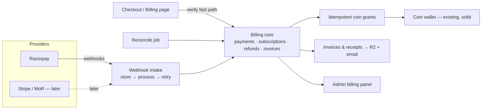

# Kissago payments & billing — suggested plan

_2026-09-17 · branch `payments` · roadmap for the owner to choose direction; nothing here is built yet_

**Who this is for:** the owner deciding what to build and in what order. It builds on [billing-audit-2026-09-17.md](billing-audit-2026-09-17.md); finding IDs (B1, H4…) refer to that document.

**What this is not:** an implementation plan. Per `docs/agent-context/WORKING_AGREEMENTS.md`, each phase below gets its own self-contained handover plan (exact edits, complete migration SQL, verification) once you approve the direction.

---

## 1. Recommendation in one paragraph

Don't add features first. **Make the money path correct, keep permanent records, and give support the tools to fix problems. Then build the user billing area on top.** Kissago's own database should be the source of truth for every payment, subscription, invoice and refund, with Razorpay (and later Stripe or a merchant of record) acting as an adapter. Phases 1–3 and Phase 6 are the **live-money gate**: nobody pays real money until they're done. Phases 4–5 deliver the ChatGPT/Claude-style experience and can ship to a closed group first. International payments come last, and probably not through Stripe India (see Phase 7).

---

## 2. Decisions needed from you first

Each has a recommendation. Phase 1 can start with only D1 and D2 settled; the rest are needed before the phase noted.

| # | Decision | Recommendation | Needed before |
|---|---|---|---|
| D1 | **Launch price and coin value.** Prod has Plus at ₹1,450 → 300 coins; dev at ₹850 → 120. Today a subscription coin costs more than a top-up coin, and subscription coins expire (H12). | Treat **prod** as the source of truth. Make a subscription coin **cheaper** than a top-up coin, or state clearly which tier features justify the premium. Users compare. | Phase 6 (catalog), but decide early since it shapes copy |
| D2 | **Who issues invoices.** | **Kissago issues its own receipts/invoices** from its own records, numbered by Kissago. Razorpay's documents can't be the record once Stripe or a merchant of record joins, and GST requires the customer's state, which only Kissago can collect. Before GST registration (below ₹20 lakh turnover), issue a plain **receipt** with no GST. Design the schema for full tax invoices from day one. **Stream 06 settles this:** Razorpay's Invoices API can only create non-GST invoices. | Phase 2 |
| D3 | **Refund policy for coins.** | Refund on request within **7 days** if **fewer than ~20% of that purchase's coins** were used; claw back the unused coins from that grant; consumed coins are non-refundable. On a chargeback, revoke unused coins and flag the account. Mirrors ChatGPT's 7-day discretionary window. | Phase 3 (tools) and Phase 6 (policy text) |
| D4 | **Rollover of unused subscription coins.** | **No rollover in v1.** Say so plainly at checkout ("coins reset each billing month") and keep the dormant plumbing (M4) for later. Fewer tax questions (stream 07: expiring vs non-expiring coins may be taxed differently). | Phase 4 |
| D5 | **Billing emails.** | Required for launch (receipts, failed payment, cancellation, refund). Use **Resend** or **Postmark**; both are simple from Next.js. Until they're live, turn Razorpay's subscription notifications back on (`customer_notify`) as a stopgap. That restores its failed-payment email with the update-card link. The RBI pre-debit notice comes from the bank either way (stream 06). | Phase 5 (Razorpay notify stopgap in Phase 1) |
| D6 | **Minors.** | The paying account must be an adult: an adult attestation at checkout, and no checkout from kids mode (Indian Contract Act §11). | Phase 4 |
| D7 | **Blocked or deleted users with a live subscription.** | **Block** → cancel at cycle end and stop grants while blocked. **Deletion** → cancel immediately first, then anonymise the user but **keep** billing records for 8 years. | Phase 3 |
| D8 | **International route.** | Don't plan on Stripe India (invite-only since May 2024; stream 08). Choose later between a **merchant of record** (it handles global VAT and pays out to India) and a **foreign entity + Stripe**. Build the provider adapter now so either is additive. | Phase 7 |
| D9 | **Engage a CA** on the questions in `research/07-…md` → "Questions to take to the CA", chiefly whether coins are taxed at purchase or at redemption. | Start now; the answer shapes invoice timing and refund credit notes. | Phase 5 |

---

## 3. Architecture principles

1. **Kissago's records are the source of truth.** Every charge, including renewals, becomes a Kissago payment row. Invoices and refunds are Kissago rows. The provider's IDs are references.
2. **One idempotent grant path.** Coins are granted in exactly one place, enforced by a database unique constraint. There are three triggers into that path:
   - **Webhooks:** the primary trigger.
   - **The browser verify call:** a fast path so the user sees coins immediately.
   - **A scheduled reconcile job:** the safety net for anything missed.
3. **Money records are never deleted.** Billing tables stop cascading from `auth.users`; user deletion anonymises them.
4. **The server enforces every switch.** A UI flag is never the only guard.
5. **Fail closed and ship behind flags.** This is the project convention. New tables are optional until their migration is applied everywhere.
6. **Provider adapter boundary.** A small interface covers create checkout, cancel, refund, fetch payment/subscription and parse webhook, with Razorpay as its first implementation. Stripe or a merchant of record plugs in later without touching the billing UI.

---

## 4. Phases

Sizes are rough: **S** is a few days, **M** about a week, **L** about two weeks, for one focused implementer.

### Phase 1 — Make money movement correct · **live gate** · M

Fixes B1, B2, B3, B4, B5, B7, H2, H9, H10, M1, M3 and M9. No user-visible feature, just correctness.

1. **Grant idempotency in the database:** a unique index on coin grants per `(source_type, source_ref_id)` for payment-backed sources, with grants written as insert-on-conflict-do-nothing. Before the migration, check dev for existing duplicates (stream 03 found none).
2. **Webhook intake that retries:** reprocess events stored as `received` or `failed`, not just new ones. Log and alert on signature/config errors, and handle `subscription.charged`, `subscription.halted`, `subscription.cancelled`, `subscription.completed`, `payment.failed`, `refund.*` and `payment.dispute.*` explicitly. Refunds and disputes are **recorded** here; acting on them comes in Phase 3.
3. **Verify uses only stored IDs.** Sync must never rewrite the owner of an existing subscription row.
4. **Server-side kill switch:** checkout creation and verify both honour `pricing_checkout_enabled`.
5. **Mode-safe plan references:** record whether each cached Razorpay plan ID came from test or live, ignore a mismatched one, and make plan creation race-safe.
6. **One subscription at a time, including checkouts in progress:** extend the guard to recent unfinished subscription checkouts, and let a user abandon a stale one.
7. **Capture certainty for top-ups:** before granting in verify, fetch the payment and require `captured`. The `payment_capture` order field is deprecated, so keep the Razorpay dashboard on **automatic capture** and put that in the go-live runbook. An `authorized` payment is auto-refunded after 3 days, so a signature alone isn't proof (stream 06).
8. **Grant subscription coins only on a confirmed charge.** For cards with no `start_at`, the authentication charge is real. For UPI Autopay and eNACH it may be an uncaptured ₹1–5 token (stream 06). Grant when a **captured payment** exists for the cycle, not on `authenticated` alone. Run a sandbox trace per method (card, UPI Autopay, eNACH), and also check whether UPI Autopay caps the mandate below the 1,200-cycle `total_count` (possibly 10 years).
9. **Fix coins at checkout:** store the coin amount and price on the order when checkout is created, and grant from that.
10. **Fix `cancel_at_period_end`** so it means "scheduled to cancel, still active".
11. **Reconcile job:** hourly or daily, re-sync subscriptions near or past period end and orders stuck in `created`/`authorized`, then grant anything missing through the same idempotent path.
12. **Register the webhook** in the Razorpay **test** dashboard, prove events arrive in dev, and simulate a renewal.

**Exit:** in sandbox, a subscription renews and grants exactly once. A deliberately failed webhook is retried and succeeds. Firing verify and the webhook at the same moment grants once. Checkout off means the server refuses. Tests cover every item.

### Phase 2 — Permanent records and billing identity · **live gate** · M

Fixes H3 and H4 and lays the foundation for invoices and history.

1. **New tables** (provider-agnostic, service-role only, like today):
   - **Payments:** one row per charge, including each renewal. Amount, currency, tax amount, status, method, provider IDs, and links to order/subscription/invoice.
   - **Refunds:** amount, reason, status, provider ID, and the coins clawed back.
   - **Invoices:** number, financial year, type (receipt / tax invoice / credit note), customer snapshot (name, state, GSTIN), line items, totals, PDF location.
   - **Invoice number sequence:** per financial year, gap-free, 16 characters or fewer (e.g. `KSG/2627/000123`).
   - **Billing profile:** legal name, email, phone, **state** (required), country, and optional GSTIN, company name and address.
2. **Stop cascade deletes** on billing and grant tables: keep the rows, and anonymise the link on deletion. Retention is 8 years (stream 07).
3. **Collect state at checkout** (one prefilled field), with an optional "I'm buying for a business" GSTIN field.
4. **Backfill** payments from existing dev orders.

**Exit:** every past and new charge has a payment row, and a deleted test user's payments survive, anonymised.

### Phase 3 — Support and admin tooling · **live gate** · M

Fixes B6, H5, H6, H7, M6, and the operator side of H8.

1. **Razorpay adapter additions:** cancel subscription (now / at cycle end), refund payment (full or partial), fetch payment, fetch subscription invoices.
2. **Admin → user → Billing panel:** subscription, payments, refunds, invoices, grants (with order references) and that user's webhook events. Actions:
   - **Cancel**
   - **Refund**, with optional coin clawback per D3
   - **Re-sync from Razorpay**
   - **Negative coin adjustment**, bounded and audited like grants
3. **Webhook events viewer** with a reprocess button and a failed-events badge on the admin home.
4. **Moderation and deletion hooks** per D7.
5. **Relabel the recovery tools** for production use and add archive-safety checks: "N active subscribers on this version" (M6).
6. **Alerts:** email the owner on repeated webhook failure or a reconcile mismatch.

**Exit:** each support case in audit §5 — "paid but no coins", "cancel", "refund", "charged twice", "blocked user subscribed" — is resolvable from the admin UI without SQL.

### Phase 4 — User billing area and checkout polish · M–L

The ChatGPT/Claude-style experience. Fixes H8, H11 and M8, and D4/D6 copy.

**Billing page** (under Settings → Billing, linked from the account menu and `/wallet`):
- **Current plan:** name, price including GST, status, "Renews on 12 Oct" or "Cancels on 12 Oct", coins left this cycle and when they reset, top-up balance.
- **Actions:**
  - **Change plan:** upgrade now, downgrade at cycle end; top-ups untouched.
  - **Cancel:** self-serve, no more steps than subscribing, access until period end, optional reason.
  - **Resume:** undo a scheduled cancel.
  - **Fix payment:** retry, or re-authorise with a new card or UPI mandate.
- **Payment history:** date, description, amount, tax, status, and **Download invoice**.
- **Billing details:** name, state, GSTIN. Like Claude, changes apply to future invoices only.
- **Coin activity:** grants and spends, building on the existing wallet activity.

**Checkout polish:**
- **Summary before paying:** total including GST; "Renews every month on the 12th until you cancel"; coins per month and that they reset; a link to the refund policy; an unticked terms checkbox; the adult attestation.
- **Checkout options:**
  - prefill name, email and phone;
  - clear handling when the user closes the payment window;
  - a "confirming your payment" state for async UPI, which polls until the payment settles.
- **Screens after paying:**
  - a success screen with a receipt link;
  - a failed-renewal banner with a one-click fix;
  - no checkout in kids mode.

**Plan changes:** apply the proposed rules in `docs/future-subscription-account-management.md` (upgrade immediately, downgrade at next cycle, top-ups untouched). Razorpay's update call does prorate automatically, but it **can't swap plans on domestic-card subscriptions** and **can't update `pending` or `halted` ones** (stream 06). So use one path for every payment method:
- **Upgrade:** cancel the old subscription now, start the new one now, and grant the new plan's coins in full, with no cash proration. Simple and generous.
- **Downgrade:** cancel at cycle end, and create the new subscription with `start_at` = cycle end.

**Failed renewals:** Razorpay retries daily for about 3 days and then halts, and the decided grace period is 5 days. Kissago must send its own failed-payment email with a fix link (Phase 5), because Razorpay's is switched off.

**Exit:** a test user can subscribe, see history, download a receipt, upgrade, cancel, resume and fix a failed payment without contacting support. Playwright specs cover the signed-in billing flows.

### Phase 5 — Invoices, receipts and notifications · M

1. **Email provider** (D5) with templates:
   - payment receipt;
   - renewal coming up, if Razorpay's notice isn't used;
   - payment failed, with a fix link;
   - subscription cancelled or ending;
   - refund issued;
   - plan changed.
2. **Invoice PDFs** rendered server-side, stored in R2, emailed and downloadable. **Receipt** before GST registration; **tax invoice** (Rule 46 fields: number, date, supplier GSTIN, customer name and state, SAC, taxable value, CGST+SGST or IGST) after. **Credit notes** for refunds.
3. **Decide `customer_notify`** permanently once Kissago's own emails are live.

**Exit:** every payment produces a correct document within minutes, and every refund a credit note. The CA signs off one sample of each.

### Phase 6 — Compliance and go-live · **live gate** · S–M

1. **Policy pages:**
   - finalise and publish Refund & Cancellation, matching what Phases 3–4 actually do;
   - add a digital-delivery statement;
   - publish grievance officer details;
   - finish or hide the copyright and account-deletion drafts.
2. **Dark-pattern self-review** of checkout and cancellation against the CCPA guidelines (stream 07). This becomes an annual certificate from 1 Jan 2027.
3. **Catalog:** set the launch prices (D1) in prod.
4. **Razorpay live activation:**
   - KYC and website review;
   - register the live webhook with the event list;
   - live keys in Vercel production;
   - live plan IDs created fresh.
   Exact steps and the recommended webhook event list are in `research/06-razorpay-capabilities.md` §9 and §5. Test and live are separate data spaces, so plans are recreated in live mode.
5. **Rewrite `docs/production-pricing-rollout-checklist.md`** into one current go-live runbook.
6. **Live smoke test:** real small payment → coins → receipt → refund → clawback → credit note, then subscription → cancel.
7. Turn on `pricing_checkout_enabled` in prod for a closed group first.

### Phase 7 — International (later) · L

1. **Finish stream 08 research:** credit-product benchmarks, merchant-of-record comparison, provider-agnostic architecture patterns.
2. **Decide D8.** Recommended evaluation order:
   - a merchant of record that pays out to Indian entities (Paddle, Lemon Squeezy, Dodo Payments);
   - a foreign entity + Stripe Billing;
   - Razorpay International cards only, as a stopgap.
3. **Add the second adapter** behind the Phase 1–3 interface. The international catalog already exists; confirm export-of-services GST treatment (LUT, payment in foreign exchange) with the CA.

---

## 5. Order and dependencies

| Phase | Depends on | Live-money gate? | Migrations | Size |
|---|---|---|---|---|
| 1 Correctness | D1 (loosely), D2 | Yes | 1 small (grant unique index; order snapshot columns) | M |
| 2 Records & identity | Phase 1, D2 | Yes | Yes — main schema phase | M |
| 3 Support tooling | Phases 1–2, D3, D7 | Yes | Small (refund and adjustment functions) | M |
| 4 Billing area & checkout | Phases 2–3, D4, D6 | No, but needed for public launch | Minimal | M–L |
| 5 Invoices & emails | Phase 2, D5, D9 | No, but needed for public launch | Minimal | M |
| 6 Compliance & go-live | Phases 1–5 | Yes | None | S–M |
| 7 International | Phase 6, D8 | — | Adapter-specific | L |

Phases 4 and 5 can run in parallel after Phase 3. A **closed beta with real money** is reasonable after Phases 1–3 + 6, with receipts handled manually, if you want revenue earlier. A **public launch** needs 1–6.

## 6. Finding → phase traceability

| Phase | Findings closed |
|---|---|
| 1 | B1, B2, B3, B4, B5, B7, H2, H9, H10, M1, M3, M9 |
| 2 | H3, H4 |
| 3 | B6, H5, H6, H7, M6 |
| 4 | H8, H11, M8 |
| 5 | H1 |
| 6 | B8, H12 (catalog), low-severity doc hygiene |
| Deferred | M2 (quoted vs charged coin price — fix alongside the next image-pricing change), M4 (rollover, per D4), M5 (revenue/margin dashboard — after launch), M7 (paused messaging), single-admin/RBAC, `/pricing` marketing page, annual plans |

## 7. Explicitly out of scope for now

- Annual plans (blocked in code today; add after monthly is stable in production).
- Coin rollover (D4), revenue and margin dashboard, billing-only admin role, app-store subscriptions.
- Stripe India onboarding.

Record these in `docs/agent-context/PROJECT_STATE.md` when Phase 1 starts, per the scope-discipline agreement.
