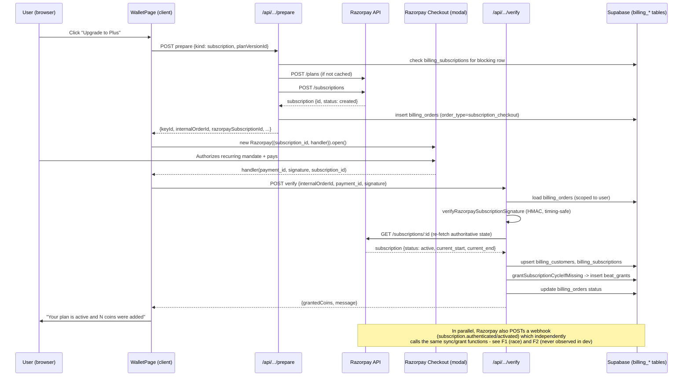
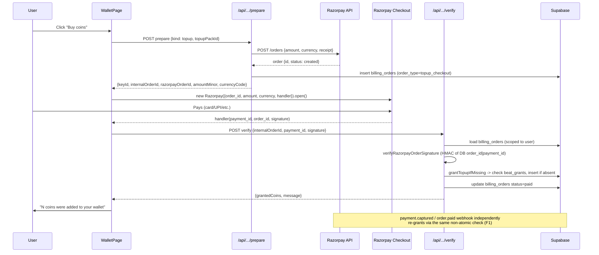

# Checkout and payment capture

_Stream 1 · audited 2026-09-17 · branch payments_

## Scope and method

Audit-only research into the Razorpay checkout and payment-capture flow: subscription purchase,
top-up coin pack purchase, renewals, webhook handling, security, and post-payment UX. Read-only:
full read of the checkout code path plus SELECT-only Supabase queries against dev
(`mcp__supabase__*`) and prod (`mcp__supabase-prod__*`) to check live billing-table state. No
writes, no builds, no payment calls, no secret values read (env var names only).

Files read in full: `components/pricing/WalletPage.tsx`, `app/wallet/page.tsx`,
`app/actions/pricing-checkout.ts`, `app/api/billing/razorpay/{prepare,verify,webhook}/route.ts`,
`lib/billing/razorpay.ts`, `lib/billing/razorpay-sync.ts`, `lib/billing/razorpay-shared.ts`,
`components/pricing/PricingRuntimeProvider.tsx`, `supabase/migrations/016_billing_core.sql`,
`supabase/migrations/017_wallet_core.sql`, `lib/types/database.ts` (billing/grant interfaces),
`docs/future-subscription-account-management.md`, `docs/production-pricing-rollout-checklist.md`.
Grepped outward for `/wallet` entry points, `pricing_checkout_enabled` usage, kids-mode surfaces,
and invoice/receipt/email code.

## Findings

| ID | Severity | Status | Finding | Evidence | Failure scenario | Direction |
|---|---|---|---|---|---|---|
| F1 | **BLOCKER** | VERIFIED | Coin grants for both top-ups and subscription cycles use a non-atomic check-then-insert with no DB unique constraint backing it — a race between the client `/verify` call and the Razorpay webhook can grant coins twice for one payment. | `lib/billing/razorpay-sync.ts:128-175` (`grantTopupIfMissing`: SELECT `beat_grants` by `(user_id, source_type, source_ref_id)`, then INSERT if none found) and `:177-230` (`grantSubscriptionCycleIfMissing`, same pattern keyed on `${subscription.id}:${current_start}`). Both paths are invoked from **two independent callers per payment**: `app/api/billing/razorpay/verify/route.ts:71-83,126-132` (client-triggered) and `app/api/billing/razorpay/webhook/route.ts:147-159,210-219` (`payment.captured`/`order.paid`/any subscription event, server-triggered). `supabase/migrations/017_wallet_core.sql:4-15` shows `beat_grants` has **no unique index** on `(user_id, source_type, source_ref_id)` — only a partial non-unique index on `(user_id, expires_at, granted_at)`. Confirmed via dev DB query: 0 duplicate `(source_type, source_ref_id)` pairs exist today, but that only reflects the small (12-order) test volume, not a guarantee. | Razorpay typically fires `payment.captured` within ~1s of the client's `handler` callback. If the webhook request and the `/verify` request both reach the server before either has committed its `INSERT`, both SELECTs see "no grant yet" and both INSERT — the user is credited coins twice for one real-money payment. | Add a unique index (e.g. `CREATE UNIQUE INDEX ON beat_grants(user_id, source_type, source_ref_id) WHERE source_ref_id IS NOT NULL`) and switch both grant functions to `INSERT ... ON CONFLICT DO NOTHING` (or catch the unique-violation and treat as already-granted) instead of SELECT-then-INSERT. |
| F2 | **BLOCKER** | VERIFIED | The webhook path — the only mechanism for recurring renewals, `halted`/`cancelled`/refund/dispute state, and any payment that completes after the client tab is gone — has **never received a single event** in dev, and a missing `RAZORPAY_WEBHOOK_SECRET` crashes the route before anything is logged. There is no polling/reconciliation fallback for billing anywhere in the app. | Dev query: `select count(*) from billing_webhook_events` → **0 rows**, ever (queried 2026-09-17). Prod query: all four billing tables (`billing_orders`, `billing_subscriptions`, `billing_customers`, `billing_webhook_events`) → **0 rows**. `app/api/billing/razorpay/webhook/route.ts:39` calls `verifyRazorpayWebhookSignature`, which calls `ensureRazorpayWebhookSecret()` (`lib/billing/razorpay.ts:63-71`, throws `Missing RAZORPAY_WEBHOOK_SECRET` if unset) **outside** the route's try/catch that persists failures (that try/catch starts at line 76, only wrapping `processWebhookPayload`) — so a misconfigured secret fails before any `billing_webhook_events` row is even written, leaving zero trace in the DB. `app/api/batch/reconcile/route.ts:1-9` (the app's only cron) reconciles image/narration jobs and agentic runs only — no billing/Razorpay code path exists there or anywhere else in `app/api`. The one dev subscription row (`status: active`, `current_period_end: 2026-05-08`) has not advanced since April despite "today" being 2026-09-17, consistent with the renewal webhook (`subscription.charged`) never having arrived. | A live customer's card is charged for month 2. If `subscription.charged` doesn't arrive (webhook misdelivered, endpoint URL not registered for the live mode, secret misconfigured in the hosting env, or a transient outage with retries exhausted), the user is charged but receives **no new coins**, and `billing_subscriptions.status`/`current_period_end` stay stale indefinitely — nothing else ever re-checks Razorpay. Refunds and disputes (see F5) hit the same blind spot. | Before accepting live payments: (1) confirm the live-mode webhook URL is registered in the Razorpay dashboard and `RAZORPAY_WEBHOOK_SECRET` is set in every env that needs it; (2) add a periodic reconciliation job (extend `/api/batch/reconcile` or a new cron) that re-fetches subscriptions nearing/past `current_period_end` and re-syncs from the Razorpay API as a backstop for missed webhooks; (3) wrap the signature-verification throw in its own try/catch so a config error is at least logged/alerted, not silently swallowed by a bare 500. |
| F3 | **BLOCKER** | VERIFIED | `pricing_checkout_enabled` — the flag the team's own rollout doc calls the mechanism keeping "pricing... operationally dormant... until flags are enabled" — is enforced **only in the UI**. Neither `app/actions/pricing-checkout.ts` nor the `/api/billing/razorpay/{prepare,verify}` routes check it. | Grep across the repo (`pricing_checkout_enabled`/`pricingCheckoutEnabled`) shows every reference is client-side (`components/pricing/WalletPage.tsx:284`, `components/story/{StoryScreen,LandingScreen}.tsx` for hint text) or in `lib/pricing/enforcement.ts:374,404` (only used to pick an error *message*, not to block). `app/actions/pricing-checkout.ts` (full file read) only gates on `pricing_india_only_beta_enabled` (`:164-168`) — never on `pricing_checkout_enabled`. `supabase/migrations/032_managed_pages.sql:324` and `docs/production-pricing-rollout-checklist.md:79` both describe this flag as the intended kill switch, with the recommended production state `pricing_checkout_enabled = false`. | An admin flips `pricing_checkout_enabled` off in production (e.g. mid-incident, or fraud, or to gate a controlled soft-launch) expecting checkout to stop. The UI buttons do grey out, but a direct `POST /api/billing/razorpay/prepare` (and `/verify`) with a valid session still creates a real Razorpay subscription/order and, on completion, grants coins — because nothing server-side reads the flag. Anyone who has the request shape from the client bundle (or a bot) can check out while the team believes checkout is off. | Re-check `pricing_checkout_enabled` server-side at the top of `prepareRazorpayCheckoutInternal` (and ideally in `/verify` before granting) the same way `assertBetaMarketAllowed` already does for the market flag, so the flag is an actual kill switch and not just a UI affordance. |
| F4 | HIGH | VERIFIED | The "one Razorpay subscription at a time" guard checks `billing_subscriptions`, which is only populated **after** `/verify` or a webhook lands — so it cannot see a subscription that was just created at Razorpay but not yet completed, letting a user accumulate two live recurring subscriptions before either syncs. | `app/actions/pricing-checkout.ts:50-65`: the blocking query is `.from('billing_subscriptions')...`, not `billing_orders`. `syncRazorpaySubscriptionState` (`lib/billing/razorpay-sync.ts:17-126`) is the only writer of `billing_subscriptions`, and it's called only from `/verify` (`app/api/billing/razorpay/verify/route.ts:71-83`) or the webhook (`app/api/billing/razorpay/webhook/route.ts:147-159`) — both happen strictly after checkout completion/authentication. Documented intent in `docs/future-subscription-account-management.md:6-13` describes the guard as covering "a live or in-progress state," but the code's definition of "in-progress" starts only once a sync has occurred. | User clicks "Upgrade" twice in quick succession (two tabs, a retry after the modal appears stuck, or a page reload mid-checkout before dismissing the first modal). Each `prepareRazorpayCheckoutInternal` call passes the blocking check (no `billing_subscriptions` row exists yet for either attempt) and creates its own Razorpay subscription + `billing_orders` row. If the user completes payment authorization on both (plausible: Razorpay may also resend a payment-completion reminder for an unfinished `created` subscription), they end up with two active recurring subscriptions charging them independently, each also granting its own first-cycle coin batch. | Extend the blocking check to also cover `billing_orders` rows of `order_type='subscription_checkout'` with `status` not in a terminal-failed set and `created_at` within a short window (e.g. last 15–30 min), or hold a short-lived per-user advisory lock across `prepareRazorpayCheckoutInternal` for subscription checkout. |
| F5 | HIGH | VERIFIED | Refund and dispute webhooks are silently no-op'd: the webhook handler marks them `processed` but never revokes granted coins, never marks the order/subscription as refunded/disputed, and surfaces nothing to admins. | `app/api/billing/razorpay/webhook/route.ts:247-261`: `isSuccessfulTopupWebhookEvent` only matches `payment.captured`/`order.paid`; `getTopupOrderStatusFromWebhookEvent` only special-cases `payment.failed` (and only downgrades if not already `paid`) — any other event (including `refund.created`, `refund.processed`, `payment.dispute.created/won/lost`) falls through `return currentStatus`, i.e. no change. Since these events still resolve to a matching `billing_orders` row via `payment.entity.order_id` (`:187-201`), the webhook is recorded as `status: 'processed'` even though it did nothing — there's no signal in `billing_webhook_events` or anywhere else that a refund/dispute happened. No `refunded`/`disputed` status exists in the `billing_orders.status` domain at all (migration `016_billing_core.sql:49` only defaults `'created'`, values otherwise come straight from provider strings). | A user buys a top-up, gets the coins, requests (or wins a chargeback for) a refund through Razorpay. Razorpay refunds the money; the app never finds out — the user keeps the coins they already spent or still have, and support has no record in the product that a refund happened unless they cross-reference the Razorpay dashboard manually. | Handle `refund.created`/`refund.processed` and `payment.dispute.*` explicitly: mark the order `refunded`/`disputed`, and decide/implement a coin-clawback policy (revoke unused `beats_remaining` on the associated grant, or flag the account for manual review if already spent). |
| F6 | MEDIUM | INFERRED | `createRazorpayOrder` never sets `payment_capture`, so whether a top-up payment actually gets auto-captured (vs. sitting `authorized` and eventually voided) depends entirely on the Razorpay account's dashboard-level default, which this audit cannot verify from code alone. | `lib/billing/razorpay.ts:122-137`: the `/orders` request body sends only `amount`, `currency`, `receipt`, `notes` — no `payment_capture` field. No code anywhere calls Razorpay's explicit Capture API either (grep for "capture" across `lib/billing` found nothing beyond the `receipt` field name coincidence). Marked INFERRED because Razorpay's actual default behavior for an account is a platform-configuration fact, not something visible in this repo — cross-check with stream 6 (Razorpay capabilities research). | If the connected Razorpay account (especially once switched to live keys) has manual capture enabled at the account level, every top-up payment stays `authorized` and is never captured by this code — no `payment.captured`/`order.paid` webhook ever fires, no coins are ever granted, and the authorization silently auto-voids after Razorpay's hold window (commonly ~5–7 days for cards), returning the money to the customer with no error surfaced anywhere in the app. | Set `payment_capture: 1` explicitly on order creation (belt-and-suspenders even if the account default is already auto-capture) and confirm the live Razorpay account's capture setting before go-live. |
| F7 | MEDIUM | VERIFIED | Coin/price amounts granted are read live from `pricing_topup_packs`/`pricing_plan_versions` at `/verify` or webhook time, not snapshotted on the `billing_orders` row at checkout time — an admin edit to a pack's `beat_amount` or a plan's `monthly_included_beats` mid-checkout changes what the payer actually receives relative to what they were shown and charged for. | `app/api/billing/razorpay/verify/route.ts:125,186-208` (`loadTopupPack` re-fetches by id, no status/amount pinning) and `:69,162-184` (`loadPlanVersion` same pattern); `lib/billing/razorpay-sync.ts:216` (`beats_total: input.planVersion.monthly_included_beats`) and `grantTopupIfMissing` (`:158-159`, `beats_total: input.topupPack.beat_amount`) both use the freshly-loaded row, not anything captured on `billing_orders` at order-creation time. `billing_orders` (`016_billing_core.sql:39-55`) stores only `plan_version_id`/`topup_pack_id` references and the price paid (`amount_minor`), not the coin amount. | Admin edits a top-up pack's coin amount (e.g. correcting a pricing mistake) while a customer's checkout is mid-flight (order already created with the old price shown). The customer completes payment at the old price but is granted the new (different) coin amount. | Snapshot the granted-coin amount (and ideally currency/price) onto `billing_orders` at prepare time and grant from that snapshot, not from a live re-read of the catalog row. |
| F8 | LOW–MEDIUM | VERIFIED (also independently flagged in stream 6's notes, corroborating) | `cancel_at_period_end` is only ever set `true` once the Razorpay subscription's status is *already* `'cancelled'` — it can never represent "cancellation scheduled, still active until period end," despite the column existing for exactly that purpose. Currently dormant (no UI reads it yet), but will misbehave the moment a self-serve "cancel" UI is built on top of it (planned per `docs/future-subscription-account-management.md`). | `lib/billing/razorpay-sync.ts:77` and `:100`: `cancel_at_period_end: input.subscription.status === 'cancelled'` in both the update and insert branches. `supabase/migrations/016_billing_core.sql:30` defines the column with the standard Stripe/Razorpay-style semantics ("will cancel at period end, still active now"), which this line doesn't implement. | A future "Manage subscription → Cancel" feature calls Razorpay's cancel-at-cycle-end API, expects `cancel_at_period_end=true` while `status` stays `active` in the interim, and shows the user "your plan ends on \<date\>" — but this code only ever flips the flag once the subscription is already fully `cancelled`, so that UI would never show the intended "scheduled to cancel" state. | Fix the assignment to reflect an actual scheduled-cancellation signal from Razorpay (or track it separately) before building cancel UI on top of it. |
| F9 | LOW | VERIFIED | Abandoned checkouts leave permanently orphaned `billing_orders` rows in `status: 'created'` with no cleanup — clutter, not a money-correctness bug. | Dev query: of 12 `billing_orders` rows, 9 subscription-checkout rows are stuck at `status: 'created'` (dated April–July 2026), 1 topup at `created`; only 1 subscription reached `active` and 1 topup reached `paid`. No code path (route, action, or the reconcile cron) ever revisits or expires stale `created` orders. | Not a functional bug today, but as volume grows this table accumulates dead rows indefinitely and any future "your purchase history" UI (see gap list) would need to filter them out explicitly or they'd look like failed/duplicate purchases to the user. | Optionally expire/mark stale `created` orders after a timeout via the reconcile cron; low priority. |

## 1. Entry points

Every place a signed-in *or* signed-out user is steered toward `/wallet` (the only checkout
surface — there is no separate `/pricing` or `/upgrade` route):

- `components/auth/UserMenu.tsx:209-213` — a persistent "Wallet & Billing" link in the account
  menu (shown to signed-in users; the menu itself is part of the always-visible header).
- `components/story/StoryScreen.tsx:1753` — Creator Settings panel's `onViewPlans` → `router.push('/wallet')`.
- `components/story/StoryScreen.tsx:4634-4639, 5629-5635` — video-export / reel-download gating:
  if the pricing runtime denies export access (`auth.status === 'denied'`) or the plan doesn't
  include video export, the export button opens `/wallet` in a new tab.
- `components/story/LandingScreen.tsx:1419-1424` — a locked reel visual style routes to `/wallet`
  on click.
- `components/story/LandingScreen.tsx:885-889` and `components/story/ContinueAsEpisodeDialog.tsx:182`
  — inline "you need N coins / checkout is still unavailable" messages when
  `authorizeCurrentUserBillableAction` (entitlements — stream 2's territory) returns
  `reason: 'insufficient_balance'` or `'checkout_unavailable'`; these are text-only in the
  components read here and don't render their own "buy coins" button, they rely on the user
  navigating to the wallet themselves via the menu.
- `components/pricing/WalletPage.tsx` itself is the landing point for all of the above and is
  reachable directly at `/wallet` for anyone, signed in or not.

**Signed-out behaviour:** `/wallet` renders fully for a signed-out visitor (plan cards, coin-pack
cards, balances) but every checkout button is disabled and reads "Sign in to continue"
(`WalletPage.tsx:571-606,843-853`, driven by `!pricingData.userId`). `prepareRazorpayCheckoutInternal`
also independently requires a session (`getAuthenticatedUser()` throws "Please sign in before
starting checkout" → mapped to HTTP 401 in `app/api/billing/razorpay/prepare/route.ts:28`), so
even a direct API call without a session is rejected server-side. No client-side-only gate here.

**Kids mode:** `app/gallery/kids/page.tsx` and `components/gallery/KidsGalleryBrowser.tsx`
(read in full) import no `UserMenu`, no wallet link, and no checkout-related component at all —
grep for `wallet`/`Wallet`/`upgrade` inside `KidsGalleryBrowser.tsx` returns nothing. Kids mode is
a pure discovery/watch surface with **zero checkout entry points** by construction (VERIFIED).
(Whether this is deliberate for compliance reasons is stream 7's territory — noting only the code
fact here.)

## 2. Subscription purchase, end to end

Sequence (VERIFIED from `app/actions/pricing-checkout.ts`, `app/api/billing/razorpay/{prepare,verify}/route.ts`,
`lib/billing/razorpay.ts`, `lib/billing/razorpay-sync.ts`):

1. **Prepare** (`components/pricing/WalletPage.tsx:379-427` → `POST /api/billing/razorpay/prepare`
   → `prepareRazorpayCheckoutInternal`, `app/actions/pricing-checkout.ts:30-108`):
   - Auth required (`getAuthenticatedUser`, throws if signed out).
   - Loads the published, `provider='razorpay'` plan version for the requested market
     (`loadPlanVersionForCheckout`); rejects the free plan, zero-price versions, and annual
     billing on Razorpay (`:42-48`, a deliberate "monthly only for India, for now" guard).
   - `assertBetaMarketAllowed` — server-side check of `pricing_india_only_beta_enabled` (this one
     **is** enforced server-side, unlike `pricing_checkout_enabled` — see F3).
   - **Blocking-subscription guard** (`:50-65`) — queries `billing_subscriptions` for this user;
     blocks a second attempt only if a row already exists with status in
     `created|authenticated|active|pending|halted` (see F4 for the gap: this table is empty until
     a checkout has already been verified/webhooked once).
   - `ensureRazorpayPlanRef` (`:272-306`) lazily creates a Razorpay **Plan** (`POST /plans`) the
     first time a given `pricing_plan_versions` row is sold, and persists
     `provider_product_ref`/`provider_price_ref` back onto that row so it's reused thereafter.
   - `createRazorpaySubscription` (`POST /subscriptions`, `lib/billing/razorpay.ts:99-114`) —
     `total_count: 1200` (monthly) or `100` (annual, currently unreachable for Razorpay per the
     guard above), `customer_notify: 0` (Razorpay's own notification emails are suppressed —
     and the app sends none of its own, see gap list), `notes: {user_id, plan_version_id, pricing_market_key}`.
   - Inserts a `billing_orders` row (`order_type: 'subscription_checkout'`,
     `provider_checkout_session_id: subscription.id`, `status: subscription.status` — typically
     `'created'` at this point, `amount_minor`/`currency_code` from the plan version).
   - Returns `{keyId, internalOrderId, razorpaySubscriptionId, displayName, description, userName, userEmail}`
     to the client — note **no amount is returned or trusted from the client** for subscriptions;
     the amount lives entirely inside the Razorpay Plan object created server-side.
2. **Open Razorpay Checkout** (`WalletPage.tsx:965-1060`, `openRazorpayCheckout`):
   - `new window.Razorpay({key, name, description, prefill:{name,email}, theme, modal:{ondismiss}, subscription_id, handler})`.
   - Uses the **`handler` callback** (in-page JS callback), *not* `callback_url` (server redirect)
     — the whole flow stays client-side until the final `/verify` POST.
   - `modal.ondismiss` rejects with `Error('Razorpay checkout dismissed')`, which the caller
     special-cases to *not* show an error banner (`WalletPage.tsx:420-423`) — the UI just quietly
     resets, no "still processing" messaging (see edge cases, UPI).
   - `instance.on('payment.failed', ...)` surfaces Razorpay's own failure description/reason as
     the rejected error.
3. **Verify** (`handler` → `POST /api/billing/razorpay/verify`,
   `app/api/billing/razorpay/verify/route.ts:24-109`):
   - Requires a session; loads the `billing_orders` row scoped to `(id, user_id, provider='razorpay')`
     — an attacker cannot verify another user's order (ownership enforced at the query level).
   - `verifyRazorpaySubscriptionSignature({subscriptionId: billingOrder.provider_checkout_session_id, paymentId: body.razorpayPaymentId, signature: body.razorpaySignature})`
     — HMAC-SHA256 of `paymentId|subscriptionId` with `RAZORPAY_KEY_SECRET`, timing-safe compared
     (`lib/billing/razorpay.ts:148-155,246-259`). **The subscription id used for the signature
     check comes from the server-side DB row, never from the client body** — so a client can't
     substitute a different subscription id into the check.
   - On success: `fetchRazorpaySubscription` (re-fetches authoritative state from Razorpay) →
     `syncRazorpaySubscriptionState` (see below) → updates the `billing_orders` row's status and
     payload → returns `{grantedCoins, message}` to the client.
4. **`syncRazorpaySubscriptionState`** (`lib/billing/razorpay-sync.ts:17-126`), the single function
   that both `/verify` and the webhook call:
   - Upserts `billing_customers` (only if Razorpay has attached a `customer_id` yet — otherwise a
     `pending_<subscriptionId>` placeholder is stored, self-healing on a later sync).
   - Upserts `billing_subscriptions` (insert if no row exists for this `provider_subscription_id`,
     else update) with `status`, `current_period_start/end`, `cancel_at_period_end` (see F8),
     `grace_period_ends_at` (only computed when status is `pending`/`halted`).
   - Calls `grantSubscriptionCycleIfMissing` (see F1) — only grants if `status` is `active` or
     `authenticated` **and** `current_start`/`current_end` are present; keyed by
     `${subscription.id}:${current_start}` so a genuinely new billing cycle gets a fresh grant.
   - Invalidates the pricing-runtime cache for the user so the wallet balance refreshes.
5. **Client finishes**: shows a success message (`grantedCoins > 0` → "...N coins were added" else
   a softer "coins will appear as soon as the current cycle grant is confirmed"), calls
   `refreshPricing()` + `loadWalletData()` + `router.refresh()` (`WalletPage.tsx:415-419`).

## 3. Top-up coin pack purchase, end to end

Same shape, simpler (no recurring object, no plan/subscription creation):

1. **Prepare** (`pricing-checkout.ts:111-161`): loads the published `provider='razorpay'`
   top-up pack for the market, rejects zero-price packs, creates a Razorpay **Order**
   (`POST /orders`, `lib/billing/razorpay.ts:122-137`) with `amount = topup.price_minor`,
   `currency = topup.currency_code`, `receipt = kissago_<packKey>_<timestamp>`,
   `notes: {user_id, topup_pack_id, pricing_market_key}`. Inserts a `billing_orders` row
   (`order_type: 'topup_checkout'`, `provider_order_id: order.id`, `status: order.status`).
2. **Checkout modal**: `options.order_id/amount/currency` set from the server-prepared values
   (`WalletPage.tsx:1039-1045`); same `handler`/`ondismiss`/`payment.failed` wiring as subscriptions.
3. **Verify** (`verify/route.ts:111-156`): loads the `billing_orders` row (ownership-scoped),
   `verifyRazorpayOrderSignature({orderId: billingOrder.provider_order_id, paymentId, signature})`
   — again, **orderId comes from the DB row, not the client body** (`body.razorpayOrderId` is
   received but unused for the signature check — VERIFIED, `verify/route.ts:115-119`). On success,
   `grantTopupIfMissing` (F1) grants `topupPack.beat_amount` beats (`* COINS_PER_BEAT` coins) keyed
   by `source_ref_id = billingOrder.id` (so re-running verify on an already-granted order is a safe
   no-op *sequentially* — only concurrent calls double-grant, see F1). Order status set to `'paid'`.

## 4. Recurring renewals

Month-2+ charges are driven entirely by Razorpay's own subscription billing (the app never
initiates a renewal charge itself). What's supposed to happen:

- Razorpay auto-charges the saved mandate at `charge_at`/`current_end` and fires a
  `subscription.charged` webhook (and typically an `invoice.paid` webhook alongside it).
- The webhook handler's subscription branch (`app/api/billing/razorpay/webhook/route.ts:116-185`)
  doesn't switch on the specific event name — for **any** webhook that carries
  `payload.subscription.entity.id`, it re-fetches the subscription from Razorpay
  (`fetchRazorpaySubscription`) and calls `syncRazorpaySubscriptionState`, which:
  - Updates `current_period_start/end` to the new cycle.
  - Grants a fresh cycle via `grantSubscriptionCycleIfMissing`, keyed by
    `${subscription.id}:${current_start}` — a new `current_start` value (new cycle) produces a new
    `source_ref_id`, so month 2 gets its own grant distinct from month 1's (VERIFIED design intent).
- This generic "any subscription event → re-sync from source of truth" approach is a reasonable
  design **in principle** for covering `halted`/`cancelled`/`paused`/`completed`/`pending` — it
  doesn't need per-event-name branches because it always re-reads the current truth from Razorpay.

**What's actually been verified in this codebase's real usage: none of it.** Per F2, zero webhook
events have ever been recorded in dev, and the one dev subscription with `status: active` has a
`current_period_end` of 2026-05-08 that has not advanced despite being four months stale as of
today (2026-09-17) — strongly suggesting the renewal event either never fired or was never
delivered to this app. There is no reconciliation job to catch a missed renewal webhook (F2). This
is the single biggest unverified surface in the whole checkout flow given the owner's stated goal.

## 5. Sandbox vs live

**VERIFIED:** there is no code-level distinction between sandbox and live mode. `getRazorpayConfig()`
(`lib/billing/razorpay.ts:230-244`) reads exactly three env vars — `RAZORPAY_KEY_ID`,
`RAZORPAY_KEY_SECRET`, `RAZORPAY_WEBHOOK_SECRET` — with no branching on a `NODE_ENV`,
`VERCEL_ENV`, or an explicit "test mode" flag. Razorpay itself distinguishes test vs live purely by
which key pair is configured (`rzp_test_...` vs `rzp_live_...`), so **going live is purely an env-var
swap** in whatever hosting env is being promoted (Vercel project env vars) — there's nothing in
application code that needs to change. `.env.example:67-69` documents the three names only (no
values, consistent with the redaction rule for this audit).

**Plan-ID mapping per mode:** `pricing_plan_versions.provider_price_ref`/`provider_product_ref`
are populated lazily and **cached on first sale** (`ensureRazorpayPlanRef`,
`pricing-checkout.ts:272-306`). This is a real go-live hazard: if a plan version was ever sold once
under test keys, its `provider_price_ref` is a **test-mode Razorpay Plan ID**. Switching
`RAZORPAY_KEY_ID`/`SECRET` to live keys without also clearing/resetting `provider_price_ref` (and
`provider_product_ref`) on `pricing_plan_versions` would make `ensureRazorpayPlanRef` reuse the
stale test-mode plan ID against the live API, which will fail (Razorpay plan IDs are mode-scoped)
— or worse, silently target the wrong Razorpay environment if IDs ever collided (they don't in
practice, but the failure mode here is "checkout breaks," not a security issue). **What must
change to go live:** (1) swap the three env vars to live values in the live-serving environment;
(2) null out `provider_price_ref`/`provider_product_ref` on any plan versions that were exercised
under test keys so they get re-created against the live account on first live sale; (3) register
the live-mode webhook URL + secret in the Razorpay dashboard (separate from any test-mode webhook
config) — see F2.

## 6. Edge and failure cases

- **Modal closed / dismissed:** `modal.ondismiss` → rejects `'Razorpay checkout dismissed'` →
  `WalletPage.tsx:420-423,453-455` explicitly swallows this exact message (no error banner shown).
  The `billing_orders` row stays at `status: 'created'` forever (F9) with no user-visible trace.
- **Payment failed:** `instance.on('payment.failed', ...)` surfaces Razorpay's description/reason
  as an error banner (`checkoutError`). Server-side, if a `payment.failed` webhook later arrives,
  `getTopupOrderStatusFromWebhookEvent` sets order status to `'failed'` **unless it's already
  `'paid'`** (`webhook/route.ts:251-254`) — a sensible guard against a late failure event
  clobbering an already-successful payment.
- **UPI pending/async:** Razorpay Checkout's modal handles UPI's own polling/collect-request UX
  internally; the app only ever sees a final `handler` success or a dismiss/failure. A UPI payment
  approved by the user *after* the modal was dismissed (a known real-world UPI pattern) would still
  be captured by Razorpay and fire a webhook — which this app has never been shown to reliably
  receive (F2), so a late UPI approval is a realistic path to "customer paid, got nothing," silently.
- **Authorized-but-not-captured:** see F6 — no explicit `payment_capture` flag; capture behavior is
  an account-level Razorpay setting this audit couldn't verify from code.
- **Verify arrives before webhook / webhook before verify:** both call the same idempotent-in-intent
  grant functions; sequentially this is safe (second call sees the first's grant and no-ops), but
  see F1 for the *concurrent* case.
- **Webhook retried/replayed:** exact replay of a *successfully processed* event is safe —
  `billing_webhook_events` has `UNIQUE(provider, provider_event_id)` (`016_billing_core.sql:70`) and
  the route short-circuits with `{ok: true, duplicate: true}` (`webhook/route.ts:46-57`).
  **Reviewer correction (Opus):** the short-circuit ignores the stored `status`. An event whose
  processing threw is saved as `failed` and answered 500 (`:93-104`); Razorpay's retry carries the
  same event ID, hits the duplicate branch and gets 200. **A failed webhook is never reprocessed.**
  See finding F-R1.
- **Webhook out of order:** the "always re-fetch current state from Razorpay" design (section 4)
  makes this largely self-correcting for subscriptions — an out-of-order `subscription.activated`
  arriving after `subscription.charged` would just re-sync to whatever Razorpay currently reports,
  not blindly apply the older event's data. Order-branch webhooks (top-ups) are simpler
  (idempotent status transitions) so ordering matters less there.
- **`halted`/`cancelled`/`paused`/`completed`/`pending`:** all handled generically via the
  re-fetch-and-sync path (section 4); grace period only computed for `pending`/`halted`
  (`shouldApplyGracePeriod`, `razorpay-sync.ts:242-245`); no coin grant for anything except
  `active`/`authenticated`. `cancel_at_period_end` semantics are wrong today (F8).
- **Refund and dispute events:** not meaningfully handled — silent no-op (F5).
- **Second subscription attempt:** deliberately blocked *if* a prior attempt has already synced
  into `billing_subscriptions` (see `docs/future-subscription-account-management.md`); the gap
  before that sync happens is F4.
- **Amount/currency/plan tampering from the client:** not exploitable by design — VERIFIED
  positive finding. For subscriptions, the amount lives inside a server-created Razorpay Plan
  object; for top-ups, the Razorpay Order object is created server-side with the DB-sourced amount
  and the client-supplied `amount`/`currency` passed into the Checkout modal are cosmetic only
  (Razorpay ties the actual charge to `order_id`, not to client-supplied display fields). The
  `/verify` signature checks use the **server's stored** order/subscription id.
  **Reviewer correction (Opus):** the check does, but the subscription branch then fetches and
  syncs `body.razorpaySubscriptionId` — the client-supplied value (`verify/route.ts:70`), not the
  stored one it just verified. See finding F-R2.
- **Concurrent double-clicks:** client-side button disabling (`checkoutBusyKey`) prevents same-tab
  rapid double-submission while a checkout is in flight, but this is a UI debounce only — no
  server-side idempotency key on `prepareRazorpayCheckoutInternal` itself. For top-ups this is
  low-risk (worst case: an extra orphaned `created` order, F9). For subscriptions this compounds
  into F4.

## 7. Security

- **Signature verification:** HMAC-SHA256 via Node's `crypto.createHmac`, secret never leaves the
  server, comparison via `crypto.timingSafeEqual` with an explicit length check first
  (`lib/billing/razorpay.ts:246-259`) — correct, timing-safe implementation for all three signature
  types (order, subscription, webhook). VERIFIED.
- **Webhook raw body handling:** `request.text()` is read **before** any JSON parsing
  (`webhook/route.ts:31`), so the exact bytes Razorpay signed are what's HMAC'd — correct; a
  `request.json()`-then-`JSON.stringify()` round-trip (which would risk key-order/whitespace
  mismatches) is deliberately avoided. VERIFIED.
- **Webhook secret:** `RAZORPAY_WEBHOOK_SECRET` is required (`ensureRazorpayWebhookSecret` throws
  if absent); see F2 for the operational risk of that throw happening pre-logging.
- **Auth on prepare/verify:** both require a Supabase session; `/verify` additionally scopes the
  order lookup to `user_id = auth.user.id` so no cross-user order verification is possible.
  `/webhook` has no user auth (correct — it's server-to-server, protected by the HMAC signature
  instead).
- **Service-role usage:** all three routes use `createAdminClient()` (service role, bypasses RLS)
  for billing table writes — necessary since the webhook has no user session and since these
  tables need to be written regardless of RLS policy specifics. All queries use the Supabase query
  builder (parameterized), no raw SQL string interpolation found in this path.
- **Nothing client-trusted for money-relevant decisions:** true for amounts and for top-ups.
  **Not true for subscription verify** — see the reviewer correction under "tampering" and F-R2.

> **Reviewer-added findings (Opus, verified by reading the code):**
>
> - **F-R1 — HIGH (BLOCKER if the verify call is missed).** Failed webhooks are never reprocessed.
>   `webhook/route.ts:46-57` treats any stored event ID as a duplicate regardless of `status`.
>   *Scenario:* a renewal `subscription.charged` hits a transient DB error → row saved `failed`, 500
>   returned → Razorpay retries → 200 `duplicate` → the cycle's coins are never granted and nothing
>   alerts. Renewals have no verify call to cover for it. *Direction:* reprocess when the stored
>   status is `received` or `failed`; alert on repeated failure.
> - **F-R2 — HIGH.** Subscription verify syncs a client-supplied subscription ID.
>   `verify/route.ts:59-63` verifies against `billingOrder.provider_checkout_session_id`, then `:70`
>   fetches `body.razorpaySubscriptionId`. `syncRazorpaySubscriptionState` updates an existing
>   `billing_subscriptions` row's `user_id` to the caller (`razorpay-sync.ts:65-83`) and grants with
>   an idempotency check scoped to the caller (`:193-199`). *Scenario:* a user with one valid
>   payment signature posts another active subscription's ID → that subscription row is reassigned
>   to them and its cycle coins are granted again under their account. *Direction:* always use the
>   stored ID; never let sync overwrite `user_id` on an existing row.

## 8. Post-payment experience

- **Success:** inline banner on `/wallet` — `"Your plan is active and N coins were added."` or
  `"N coins were added to your wallet."` (or softer variants if the grant hasn't landed yet,
  `verify/route.ts:104-107,152-155`), plus a full `refreshPricing()` + `loadWalletData()` +
  `router.refresh()` to reflect the new balance immediately (`WalletPage.tsx:415-419,449-452`).
- **Failure:** amber inline banner with the raw Razorpay-provided description/reason, or a generic
  "Failed to start Razorpay checkout" for prepare-time errors.
- **Balance refresh:** handled as above; also globally re-triggerable via the
  `PRICING_RUNTIME_REFRESH_EVENT` window event (`PricingRuntimeProvider.tsx:262-275`,
  `WalletPage.tsx:333-344`).
- **Receipt/invoice/email:** **none found anywhere in the codebase.** `createRazorpaySubscription`
  explicitly sets `customer_notify: 0` (suppressing even Razorpay's own notification emails,
  `lib/billing/razorpay.ts:110`), and no code in `lib/billing`, `app/actions`, or
  `components/pricing` sends an email, generates a PDF/invoice, or stores anything invoice-shaped.
  Grep for `invoice|receipt|sendEmail|resend\.|postmark|sendgrid` inside `lib/billing` and
  `components/pricing` returns nothing beyond Razorpay's own `receipt` string field name.
- **History view:** the wallet page's "Recent activity" section is coins-only —
  `getPricingWalletPageData` (`app/actions/pricing-runtime.ts:206-295`) builds it from
  `beat_grants` and `beat_usage_events` exclusively; it never queries `billing_orders`, so **no
  real-money amount, payment method, order id, or date-stamped receipt is ever shown to the user**
  — only "+X coins" / "-X coins" entries.

## 9. Gaps vs a ChatGPT/Claude-style checkout (factual list, no proposals)

- No downloadable or emailed invoices/receipts for any purchase (subscription or top-up).
- No purchase history in real-money terms — the only "activity" view is coin-denominated, with no
  link back to the underlying `billing_orders`/payment.
- No self-serve subscription management: no cancel, no upgrade/downgrade (explicitly deferred per
  `docs/future-subscription-account-management.md`), no payment-method update, no visible "next
  charge amount/date" as a dedicated billing settings screen (the wallet page shows some of this
  contextually via `nextResetAt`/`currentPeriodEndsAt`, but there's no "Billing" tab/section
  separate from the wallet balance view).
- No saved payment method / stored Razorpay Customer for one-click repeat purchases outside a
  subscription — `billing_customers` is only populated once a subscription has synced at least
  once (`razorpay-sync.ts:31-45`); a top-up-only buyer never gets a Razorpay Customer record, so
  every top-up is a fresh checkout with re-entered payment details.
- No visible handling of refunds/disputes to the user (ties to F5) — a refunded purchase looks
  identical to a normal one in the product.
- No dunning UX beyond a single generic grace-period sentence
  (`WalletPage.tsx:548-549`: "A renewal payment needs attention...") — no retry-payment CTA, no
  update-payment-method flow, no count of retry attempts remaining.
- `customer_notify: 0` on subscription creation means the user gets **zero** email confirmation of
  any kind from either Razorpay or the app for a new subscription.

## Table: Razorpay webhook event → handled? → effect → idempotency guard

| Event | Handled? | Effect | Idempotency guard |
|---|---|---|---|
| `subscription.authenticated` | Yes (generic subscription branch) | Re-fetches subscription, upserts `billing_subscriptions`, may grant first-cycle coins if status is `active`/`authenticated` | `billing_webhook_events` unique `(provider, event_id)` for the webhook itself; `beat_grants` check-then-insert for the grant — **racy, see F1** |
| `subscription.activated` | Yes (generic) | Same as above | Same as above |
| `subscription.charged` (renewal) | Yes (generic) | New cycle grant keyed by `${subscriptionId}:${current_start}` | Same as above — **this is the event F2 shows has never actually been observed in this app's dev usage** |
| `subscription.completed` | Yes (generic) | Status sync only (no grant unless `active`/`authenticated`) | N/A (no grant) |
| `subscription.cancelled` | Yes (generic) | Status sync; `cancel_at_period_end` set `true` here (but see F8 for wrong semantics) | N/A |
| `subscription.halted` | Yes (generic) | Status sync + grace period computed (`shouldApplyGracePeriod`) | N/A |
| `subscription.paused` | Yes (generic) | Status sync only; no grant, no grace period (not in the `pending`/`halted` set) | N/A |
| `subscription.pending` | Yes (generic) | Status sync + grace period computed | N/A |
| `subscription.resumed` | Yes (generic, inferred from generic handling) | Status sync | N/A |
| `payment.captured` (order-based) | Yes (explicit) | `grantTopupIfMissing`, order status → `paid` | Check-then-insert on `beat_grants` — **racy, see F1** |
| `order.paid` | Yes (explicit, same branch as `payment.captured`) | Same as above | Same — and note both events can fire for the same order, doubling the race surface |
| `payment.failed` | Yes (explicit) | Order status → `failed` unless already `paid` | Status-transition guard is itself safe (won't downgrade a paid order); no separate dedup needed |
| `payment.authorized` | Partially — order branch matches (has `order_id`) but no explicit case, falls through as a no-op status update | None (not in successful-event set) | N/A — see F6 for whether this state is ever escaped (capture) |
| `refund.created` / `refund.processed` / `refund.failed` | No — falls through the order branch as a silent no-op (marked `processed` in `billing_webhook_events` but changes nothing) | None — coins never revoked, no order status change | N/A — **gap, see F5** |
| `payment.dispute.created` / `.won` / `.lost` | No — same silent no-op path if `payment.entity.order_id` is present; fully `ignored` if not | None | N/A — **gap, see F5** |
| Any event with neither `subscription.entity.id` nor a resolvable order id | Yes (explicitly `ignored`) | None, marked `status: 'ignored'` in `billing_webhook_events` | N/A |
| Duplicate delivery of any already-processed `provider_event_id` | Yes (explicit dedup) | Short-circuits with `{ok:true, duplicate:true}` before any processing | `UNIQUE(provider, provider_event_id)` on `billing_webhook_events` — solid |

## Open questions for the owner

1. Has the Razorpay dashboard's webhook URL actually been registered for either test or live mode?
   The DB evidence (zero webhook events, ever, in dev) is consistent with "never configured" —
   worth confirming directly against the Razorpay dashboard's webhook delivery log, since that's
   outside what this audit can see.
2. Is the connected Razorpay account's payment-capture setting "Automatic" or "Manual"? This
   determines whether F6 is live risk or moot.
3. What's the intended policy when a top-up purchase is refunded after the coins have already been
   spent (F5)? Claw back from future grants, flag the account, or accept the loss? This is a
   product/business decision this audit can't make.
4. Given `pricing_checkout_enabled` is documented as the production dormancy switch but isn't
   enforced server-side (F3), was this an intentional "UI-only for now" decision, or an oversight
   from when the flag was first wired up?
