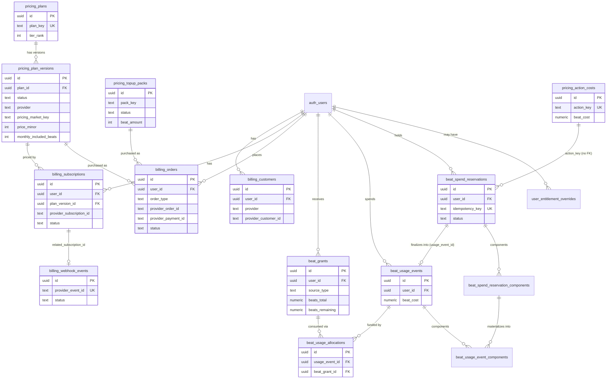

# Billing Data Model and Live DB State (dev vs prod)

_Stream 3 · audited 2026-09-17 · branch payments_

**STATUS: Resumed and substantially complete.** All three reviewer-requested follow-up checks are answered in §9 of Part B. A small residual scope remains — see "Resume here" at the bottom — but nothing below is blocked on it.

## Scope and method

Read-only audit. Part A: schema archaeology from migration files 015-022, 040, 041, 082, 096, 101, plus every other migration touching billing/pricing/wallet/entitlement objects (grep sweep across `supabase/migrations/*.sql`), cross-checked against `lib/types/database.ts`. Part B: live read-only queries against both Supabase MCP projects, confirmed by `get_project_url`. No writes, no CLI, no side effects anywhere. Per task instructions, `mcp__supabase__*` = **dev** (`dxbwzcpbfacrwrauhdbk.supabase.co`), `mcp__supabase-prod__*` = **prod** (`pddjsopcemsfiwyvhlkr.supabase.co`) — not independently re-derived beyond that explicit mapping, but the data patterns found (checkout enabled + real test payments only in the `supabase` project, everything empty/disabled in `supabase-prod`) are consistent with that labeling.

No row containing personal data (emails, names, user IDs, payment IDs) was read — every live-DB query below was an aggregate (`count`, `sum`, `group by`), so no redaction is needed anywhere in this file.

---

## Part A — Schema reference (from migrations)

### Files read in full
015, 016, 017, 018, 019, 020, 021, 022, 040, 041, 082, 084, 096, 097, 098, 101, and the `admin_grant_user_coins` function from 083 (lines 1071-1205). `lib/types/database.ts` lines 560-818 cross-checked against all of the above — every table below has a matching `Db*` interface there, field-for-field, as of that read.

### Files identified as billing-adjacent by grep but NOT YET fully read
023, 024, 039, 043 (partially checked — only a `pricing_action_costs` insert + unrelated storage policies), 046, 047, 049, 062 (partially — table name only), 063, 078 (partially — action-cost insert + RLS policies for unrelated `reference_*` tables), 079, 091, 095, 102 (partially — the `agentic_billing_bypass_enabled` flag comment only), 115. See "Resume here."

### Table-by-table reference

**`pricing_plans`** (015) — catalog root. `plan_key` UNIQUE, `tier_rank` (>0), `is_active`, `is_public`, `feature_flags_json`. Seeded rows (019): `free`(1), `plus`(2), `studio`(3). RLS enabled, **zero policies**.

**`pricing_plan_versions`** (015) — a priced, market/currency/interval-specific variant of a plan. FK `plan_id → pricing_plans`. `status` draft/published/archived. `provider` stripe/razorpay/NULL. `pricing_market_key` IN/ROW. `price_minor`, `monthly_included_beats`, `carry_forward_cap_multiplier`, `story_length_cap`, `grace_period_days`. Two **partial unique indexes** are the idempotency backbone: only one `draft` and only one `published` row can exist per `(plan_id, billing_interval, pricing_market_key, currency_code)` — this is what makes "publish a new price" a safe swap rather than a free-for-all. `provider_product_ref`/`provider_price_ref` exist for a future Stripe/Razorpay product/price ID but are unused by the current seed data (all NULL in both live DBs, confirmed for the rows queried). RLS enabled, zero policies.

**`pricing_topup_packs`** (015) — one-off coin packs. Same draft/published partial-unique-index pattern keyed on `(pack_key, pricing_market_key, currency_code)`. `beat_amount` is the internal unit granted. RLS enabled, zero policies.

**`pricing_action_costs`** (015, extended 040 → numeric(12,2) for fractional costs, extended 082 with `display_name`, `cost_family` CHECK-constrained enum, `billing_unit`, per-tier `free_enabled`/`plus_enabled`/`studio_enabled` booleans, `metadata_json`). `action_key` UNIQUE — this is the meter catalog: 25 rows live today (both envs identical, see Part B). RLS enabled, zero policies.

**`pricing_promotions`** (015) — `promo_key` UNIQUE, market-scoped, plan-targeted, `bonus_beats`, window `starts_at`/`ends_at` with a CHECK that end > start. **Zero rows in both environments** — unused so far. RLS enabled, zero policies.

**`pricing_publish_audit`** (015) — generic before/after JSON audit trail keyed by `entity_type` (plan_version/topup_pack/action_cost/promotion/runtime_setting). RLS enabled, zero policies. (Did not query row counts — see Resume here.)

**`billing_customers`** (016) — one row per `(user_id, provider)`, also unique on `(provider, provider_customer_id)`. Holds `pricing_market_key`, `country_code`, `currency_code`. RLS enabled, zero policies.

**`billing_subscriptions`** (016) — FK `plan_version_id → pricing_plan_versions` (NOT NULL — a subscription always points at a specific catalog version, which is good for historical-price integrity). Unique on `(provider, provider_subscription_id)`. `status` is a free-text column (no CHECK constraint — whatever the provider's status string is, verbatim). `current_period_start/end`, `cancel_at_period_end`, `grace_period_ends_at`, `last_webhook_at`, `raw_provider_state_json`. RLS enabled, zero policies.

**`billing_orders`** (016) — one row per checkout attempt. `order_type` CHECK ∈ {subscription_checkout, topup_checkout}. Three **partial unique indexes**, each `WHERE ... IS NOT NULL`, on `(provider, provider_checkout_session_id)`, `(provider, provider_order_id)`, `(provider, provider_payment_id)` — this is the idempotency guard against double-processing the same Razorpay order/payment. `status` is free text (default `'created'`), no CHECK constraint (contrast with `billing_subscriptions`, same pattern). `amount_minor`, `currency_code`, optional FKs to `plan_version_id` / `topup_pack_id`. RLS enabled, zero policies.

**`billing_webhook_events`** (016) — `event_type` free text, `provider_event_id` unique per `(provider, provider_event_id)` (webhook replay/dedup guard). `status` CHECK ∈ {received, processed, failed, ignored}. Optional FKs to `related_user_id`, `related_subscription_id`. RLS enabled, zero policies. **Zero rows in both environments** — see Finding B1, this is the most consequential live-state gap found so far.

**`beat_grants`** (017, `source_type` CHECK extended in 021 to add `free_allowance`) — the wallet's credit side. `source_type` ∈ {subscription, carry_forward, topup, promotion, admin_adjustment, migration_grant, free_allowance}. `beats_total`/`beats_remaining` — CHECK `beats_remaining BETWEEN 0 AND beats_total` (upgraded to `numeric(12,2)` in 040 for fractional beats). `expires_at` nullable. No FK to an originating `billing_orders`/`billing_subscriptions` row — the link back to "which payment produced this grant" lives only in free-text `source_ref_id` and `metadata_json`, not a real foreign key. RLS enabled, zero policies.

**`beat_usage_events`** (017) — one row per spend, `beat_cost` (numeric since 040), optional links to `story_id`/`beat_id`/`storyline_id`/`related_entity_id`. RLS enabled, zero policies.

**`beat_spend_reservations`** (017) — the hold/finalize/release pattern. `idempotency_key` UNIQUE (per-user in practice via app usage, but the DB constraint is global-unique, not scoped to `user_id`). `status` CHECK ∈ {pending, finalized, released, failed, expired}. `expires_at` NOT NULL. RLS enabled, zero policies.

**`beat_usage_allocations`** (017) — join table recording which grant(s) funded a usage event; unique `(usage_event_id, beat_grant_id)`, `beats_consumed > 0`. This is what lets a single spend draw from multiple grants (FIFO-ish by the ordering in the functions below). RLS enabled, zero policies.

**`beat_spend_reservation_components`** / **`beat_usage_event_components`** (082) — added for composite/multi-meter spends (e.g. an action that bills both an image meter and a text meter in one reservation). `component_key`, `cost_family`, `billing_unit`, `quantity`, `unit_beat_cost`, `quoted_beat_cost`/`beat_cost`. A trigger (`pricing_materialize_usage_components`, fired `AFTER UPDATE OF status, usage_event_id ON beat_spend_reservations`) copies `quoted`/`succeeded` components into the usage-event-components table exactly once a reservation finalizes. RLS enabled, zero policies.

**`user_entitlement_overrides`** (096) — `user_id` PK, `entitlement_plan_key` CHECK ∈ {free, plus, studio}. Explicitly documented (in the migration's own header comment) as access-only: **grants no coins, no wallet change, no subscription**. Effective tier = max(billing plan, this override) — resolved in the app layer, not SQL. RLS enabled; explicitly `REVOKE ALL ... FROM anon, authenticated` + `GRANT ALL ... TO service_role` (no end-user policies by design, same pattern as everything else here).

**`operational_policies`** / **`operational_policy_audit_events`** (084) — a small versioned key/value policy store, currently used for exactly one policy: `free_welcome_grant` (`coinAmount: 50`, `grantMode: once_per_account`, `expiresAfterDays: null`). Both RLS enabled + explicit `REVOKE ALL FROM anon, authenticated` / `GRANT ALL TO service_role`.

**`schema_migration_ledger`** (101) — operator-only, not app-facing. `REVOKE ALL FROM anon, authenticated`, `GRANT ALL TO service_role`. Self-inserts as the last statement of every migration ≥102.

**Adjacent admin tables (083, not billing but audit-trail-adjacent):** `admin_user_directory`, `user_account_moderation`, `admin_user_audit_events` (`action_type` CHECK includes `coins_granted`, extended by 096 to add `entitlement_tier_changed`), `admin_promotional_cohorts`, `admin_promotional_cohort_members` — all RLS-enabled, zero end-user policies, service_role only.

### Functions (all confirmed via 021/022/040/082/083/084/098)

| Function | Security | search_path pinned? (098) | EXECUTE granted to |
|---|---|---|---|
| `pricing_authorize_spend` | INVOKER | yes | service_role only (public/anon/authenticated revoked by 098) |
| `pricing_finalize_reservation` | INVOKER | yes | service_role only |
| `pricing_release_reservation` | INVOKER | yes | service_role only |
| `pricing_expire_stale_reservations` | INVOKER | yes | service_role only |
| `pricing_materialize_usage_components` (082, trigger) | INVOKER (trigger function, no SECURITY clause in 082) | yes (098) | trigger-invoked; not directly callable by PostgREST roles in practice regardless |
| `admin_grant_user_coins` (083) | **INVOKER** | yes (`SET search_path = public` at creation) | service_role only (explicit REVOKE/GRANT in 083 itself) |
| `admin_update_operational_policy` (084) | DEFINER | yes | service_role only |
| `apply_free_welcome_grant` (084) | DEFINER | yes | service_role only |
| `apply_free_welcome_grant_on_signup` (084, trigger on `auth.users` AFTER INSERT) | DEFINER | yes | EXECUTE revoked from PUBLIC/anon/authenticated; fires as a trigger regardless — swallows all exceptions (`WHEN OTHERS`) so a bad policy config never blocks signup |

**Correction from the paused draft:** an earlier pass of this file claimed `pricing_release_reservation` was missing from migration 098's pin/revoke lists. That was a misreading on my part — `grep -n "pricing_release_reservation" supabase/migrations/098_harden_function_privileges.sql` shows it at lines 84, 119, and in the footer verification comment at 149; it's present in both `DO $$` blocks alongside its three siblings. **Live-verified on both dev and prod** via `has_function_privilege()`: `search_path = 'search_path=public, pg_temp'` (pinned), `anon_can_execute = false`, `authenticated_can_execute = false`, `service_role_can_execute = true` — identical on both environments. No issue here after all; former Finding B3 is retracted (see Findings table).

### Coin ↔ beat conversion
The only place a coin→beat ratio is hardcoded in SQL is `apply_free_welcome_grant` (084): `v_beats := round(coinAmount / 10.0, 2)` — **10 coins = 1 internal "beat"**. Every other table stores "beats" directly (`monthly_included_beats`, `beat_amount`, `beat_cost`) with no ratio column anywhere, so there is no single source of truth for the 10:1 constant at the DB layer — it's implicit in this one function plus (presumably) app code. `admin_grant_user_coins` sidesteps this entirely by taking both `p_beat_amount` and `p_coin_amount` as independent caller-supplied parameters (SQL does not derive one from the other, and does not check they're consistent).

### RLS status — global pattern
**Every single billing/pricing/wallet table has RLS enabled and zero policies**, confirmed by `grep -rln "CREATE POLICY" supabase/migrations/*.sql` against every file that also matches `billing_|pricing_|beat_grants|beat_usage|beat_spend|wallet` — the only hits were false positives (unrelated storage/reference policies in files that also happen to touch a `pricing_action_costs` seed insert). This is a **documented, deliberate** house style: migration 097's own comment says so explicitly for `model_config`/`prompt_configs`, naming `feature_flags`, `pricing_action_costs`, `operational_policies`, `image_model_registry` as prior art for the same pattern. Consequence: **no user can read their own billing/wallet data directly via the anon or authenticated Supabase client** — a purchase-history/invoices UI must be built entirely through server actions using the service-role client (`createAdminClient()`), the same way `lib/ai/model-config.ts` does it. This is architecturally consistent, not a bug, but it's a hard constraint on how the billing UI has to be built.

### What does NOT exist (for the "ChatGPT/Claude-style billing area")
Confirmed by `grep -rniE "invoice|receipt|refund|tax|gstin|billing_address|payment_method" supabase/migrations/*.sql` across all 123 migrations:
- **No invoice/receipt table, no invoice-numbering sequence.**
- **No tax fields anywhere** — no GSTIN, no place-of-supply, no tax-amount/subtotal breakdown columns. `billing_orders.amount_minor` is a single total; any tax breakdown would have to be reverse-engineered from `raw_provider_payload_json` after the fact, per order, forever.
- **No billing-address table or columns.**
- **No refunds table.** `billing_orders.status` is free text so a `'refunded'` string *could* be written, but there's no structured refund record (amount, reason, timestamp, partial-vs-full).
- **No payment-method-on-file table** (saved cards, UPI mandates, etc.) — consistent with Razorpay-only, one-shot-checkout-per-purchase being the only flow implemented today.
- **Provider-agnostic fields for a future Stripe already exist** at the catalog/mirror layer (`provider` CHECK ∈ {stripe, razorpay} on `pricing_plan_versions`, `pricing_topup_packs`, `billing_customers`, `billing_subscriptions`, `billing_orders`, `billing_webhook_events`; `provider_product_ref`/`provider_price_ref` columns) — the schema was clearly designed with Stripe in mind from day one, it's just unpopulated (all NULL in the rows queried).
- The only "refund policy" content anywhere in the repo is CMS copy seeded by `032_managed_pages.sql`, which states in plain English: *"Refunds are not automated in the current product... Subscription changes, cancellation, and full account billing management are not self-serve."* This is a doc/code alignment worth flagging to Stream 5 — the published policy text already matches the schema reality (honest), but neither matches the owner's stated goal for this phase.

### ER diagram (mermaid) — billing/pricing/wallet tables only

Note: `billing_orders` and `beat_grants` have **no real FK to each other** — a topup order "producing" a grant is only linkable via `beat_grants.source_ref_id` (free text) / `metadata_json`, not a foreign key. Same for `billing_subscriptions` → `beat_grants` (source_type='subscription'). This matters for integrity checks (see Part B, unfinished) — "paid order with no matching grant" cannot be checked with a JOIN, only by comparing timestamps/amounts heuristically.

---

## Part B — Live state, dev vs prod

### 1. Environment confirmation
`mcp__supabase__get_project_url` → `https://dxbwzcpbfacrwrauhdbk.supabase.co` (**dev**, per task mapping).
`mcp__supabase-prod__get_project_url` → `https://pddjsopcemsfiwyvhlkr.supabase.co` (**prod**, per task mapping).

### 2. `schema_migration_ledger` — applied-ness
**Both environments are fully caught up through migration 123**, including every billing-relevant migration (015–101) and the security-hardening ones (097, 098). Migration 109 does not exist as a file in either — a numbering gap, not a missing migration.

Backfill batch (001–100) landed within the same second on both: dev `2026-08-29 18:03:37`, prod `2026-08-29 18:03:30`. From 102 onward, dev applied incrementally over 2026-09-06→2026-09-16 (one migration at a time, spread over days); **prod applied 102–123 all within a ~65-minute window on 2026-09-16** (09:24–10:28), i.e. prod was caught up to dev in one batch session on that date. One anomaly worth noting: in prod, migration 115 is timestamped `10:28:41` — *after* 116 (`09:32:18`) through 123 (`09:34:18`) — i.e. it was applied out of numeric order. Matches the standing MEMORY note that migration order is convention only, not enforced; not itself a billing bug, but confirms the ledger is trustworthy evidence (self-recorded, not assumed) rather than something to fix.

**Conclusion: no billing-relevant schema drift from unapplied migrations exists between dev and prod today.** (Data/catalog-content drift is real and separate — see below.)

### 3. Schema diff dev vs prod (functions/columns/policies)
**Not done rigorously** — only inferred from identical migration ledgers, which is strong but not conclusive evidence (a hand-run `ALTER` outside the migration file convention wouldn't show up in the ledger). No `pg_get_functiondef` comparison, no `list_tables(verbose=true)` diff was run. See Resume here.

### 4. `feature_flags` — pricing/billing/razorpay/coin/wallet/entitlement/checkout/agentic-bypass, dev vs prod

| flag_key | dev enabled | dev value | prod enabled | prod value | note |
|---|---|---|---|---|---|
| `agentic_billing_bypass_enabled` | **true** | – | **false** | – | agentic system user skips coin reservation in dev only |
| `audio_story_cover_generation_coin_cost` | true | 10 | true | 10 | match |
| `pricing_admin_bypass_enabled` | **true** | – | **false** | – | |
| `pricing_admin_tab_enabled` | false | – | false | – | match |
| `pricing_checkout_enabled` | **true** | – | **false** | – | **checkout is live in dev, off in prod** |
| `pricing_default_carry_forward_cap_multiplier` | false | 2 | false | 2 | match |
| `pricing_default_grace_period_days` | false | 5 | false | 5 | match |
| `pricing_hard_enforcement_enabled` | **true** | – | **false** | – | **spend enforcement is off in prod** |
| `pricing_india_only_beta_enabled` | true | – | true | – | match |
| `pricing_migration_grant_beats` | false | 25 | false | 25 | match |
| `pricing_reservation_timeout_seconds` | false | 1800 | false | 1800 | match |
| `pricing_routing_provider_in` | **true** | razorpay | **false** | razorpay | same value, different enabled bit |
| `pricing_routing_provider_row` | false | stripe | false | stripe | match |
| `pricing_shadow_metering_enabled` | **true** | – | **false** | – | |
| `pricing_snapshot_enabled` | **true** | – | **false** | – | |
| `pricing_story_length_ui_limits_enabled` | **true** | – | **false** | – | |
| `pricing_tester_studio_duration_days` | false | 90 | false | 90 | match |
| `vertical_reel_thumbnail_generation_coin_cost` | true | 10 | true | 10 | match |
| `visual_story_cover_generation_coin_cost` | true | 10 | true | 10 | match |

Overall: dev has checkout, hard enforcement, shadow metering, snapshotting, and story-length limits all switched ON; prod has every pricing/billing gate switched OFF except the always-on coin-cost scalars and `pricing_india_only_beta_enabled`. This matches "billing not live yet in prod" as expected pre-launch.

### 5. Catalog contents, dev vs prod

**`pricing_plan_versions`** (published rows only, differences highlighted):
- `free`: 0/0 in both markets, published in both envs — match.
- `plus` ROW/stripe: monthly 1200, annual 10800, 100 beats — match in both.
- `plus` IN/razorpay published: **dev price_minor=85000 (₹850), 12 beats** vs **prod price_minor=145000 (₹1450), 30 beats** — **diverged**.
- `studio` ROW/stripe: monthly 2900, annual 29000, 300 beats — match.
- `studio` IN/razorpay published: 395000 (₹3950), 90 beats — match in both.
- Row counts also differ (dev has more archived/superseded IN-plan-version history than prod), consistent with each environment's catalog being edited independently by an admin rather than promoted between them.

**`pricing_topup_packs`** (status × market × provider counts):
- dev: archived IN=5, draft IN=2, draft ROW=4, **published IN=2**, **published ROW=3**.
- prod: archived IN=2, archived ROW=3, draft IN=3, draft ROW=4, **published IN=3**, **published ROW=0**.
- Prod has zero published Stripe top-up packs (expected — Stripe isn't implemented as a checkout flow per the CMS copy in 032), but dev has 3 published Stripe packs that can never actually be bought today. Low-severity inconsistency, not a live-money risk.
- Published-IN-pack count differs (2 vs 3) — same independent-editing pattern as the plan versions.

**`pricing_action_costs`**: **identical in both environments** — 25 rows, same `cost_family` breakdown (text=7/7 active, image=5/5, tts=4/4, export=3/3, reference=4/4, alignment=2/1 active). This part of the catalog is in sync.

**`pricing_promotions`**: **0 rows in both environments** — unused so far.

### 6. Transactional aggregates

**Dev:**
- `billing_subscriptions`: 1 row, status=`active`, provider=razorpay.
- `billing_orders`: 12 rows total — `active`/subscription_checkout=1, `created`/subscription_checkout=8 (abandoned/incomplete checkouts), `created`/topup_checkout=2, `paid`/topup_checkout=1.
- `billing_webhook_events`: **0 rows** — see Finding B1 below.
- `beat_grants` by source_type: `admin_adjustment`=1 (10/10 remaining), `free_allowance`=6 (44 total/34 remaining), `subscription`=1 (12/12 remaining), `topup`=1 (25 total/24.2 remaining).
- `beat_spend_reservations`: `failed`=3 (all on 2026-04-08), `finalized`=16 (2026-04-08 through 2026-09-12), **0 stale pending**, no rows currently `pending`/`released`/`expired`.

**Prod:**
- `billing_subscriptions`: **0 rows**.
- `billing_orders`: **0 rows**.
- `billing_webhook_events`: **0 rows**.
- `beat_grants`: `free_allowance` only, 23 grants, 115 total = **115 remaining (100% unspent)**.
- `beat_spend_reservations`: **0 rows**.

Prod is exactly what a pre-launch database with signups-but-no-spend should look like, consistent with all the enforcement flags being off. Dev shows real sandbox exercise of the full checkout → grant → reserve → finalize loop.

### 7. Integrity checks
- **Stale pending reservations**: 0 in both environments (no `pending` rows at all currently in either).
- **Wallet balance vs stored balance**: structurally moot — no balance column/view exists anywhere (confirmed in Part A); balance is always computed live from `beat_grants.beats_remaining`, so it can't be "stale," though the underlying bookkeeping could still be wrong.
- **Duplicate provider IDs**: none found (dev; prod has no rows). See Finding B13.
- **`beat_grants` uniqueness on `(source_type, source_ref_id)`**: **no such constraint exists in either environment** — checked directly via `pg_indexes`/`pg_constraint`, not inferred. See Finding B9 (HIGH).
- **Finalized reservations vs usage events**: dev has 16 finalized reservations but only 12 have a non-null `usage_event_id` (4 don't; 0 point at a missing/deleted usage event). See Finding B10.
- **Paid/active orders with no matching grant**: 1 of dev's 2 paid/active orders doesn't turn up a linked grant via a heuristic string match (no FK exists to check this cleanly). See Finding B11.
- **Active subscriptions with no subscription-sourced grant**: 0 — dev's 1 active subscription has a matching `source_type='subscription'` grant.
- **Webhook events stuck unprocessed/errored**: moot, table is empty in both environments (B1).

### 8. `get_advisors` (security) — run on both projects, results identical. See Finding B12 for the summary; full raw output is in this session's tool history, not reproduced here to keep the file focused on billing-relevant content (only 1 of the ~4 advisory categories found — `rls_enabled_no_policy` — touches any billing/pricing/wallet object, and that's already fully covered by Finding B6).

### 9. Reviewer follow-up (requested mid-audit, after resume)

**1. Unique constraint/index on `beat_grants` covering `(source_type, source_ref_id)` or `(user_id, source_type, source_ref_id)`, dev and prod, queried directly (not inferred from migrations):** confirmed **none exists in either environment**. Full index list on `beat_grants` in both: `beat_grants_pkey` (unique, on `id`) and `idx_beat_grants_user_spendable` (non-unique, partial). Full constraint list in both: the same PK, two CHECKs (`beats_total >= 0`, `beats_remaining` between 0 and total), the `source_type` CHECK enum, and the `user_id` FK to `auth.users`. No unique constraint touches `source_type` or `source_ref_id` at all, in either database. See Finding B9.

**2. Row counts, dev vs prod, direct queries:**

| Table | dev | prod |
|---|---|---|
| `billing_orders` | 12 | **0** |
| `billing_subscriptions` | 1 | **0** |
| `billing_customers` | 1 | **0** |
| `billing_webhook_events` | **0** | **0** |
| `beat_grants` (admin_adjustment) | 1 | 0 |
| `beat_grants` (free_allowance) | 6 | 23 |
| `beat_grants` (subscription) | 1 | 0 |
| `beat_grants` (topup) | 1 | 0 |
| `beat_grants` (carry_forward / promotion / migration_grant) | 0 | 0 |

**Both parts of the checkout stream's report are confirmed correct as stated, with one clarification**: prod has zero rows across every billing table (`billing_orders`, `billing_subscriptions`, `billing_customers`, `billing_webhook_events`) — fully confirmed, prod has never processed a single checkout attempt, sandbox or otherwise. Dev's `billing_webhook_events` is also confirmed at exactly 0 rows — **but this is not "no payments were tested."** Dev **does** have real sandbox activity: 1 `billing_customers` row, 1 `billing_subscriptions` row (status=`active`), and 12 `billing_orders` rows (1 `active`, 8 `created`/abandoned subscription-checkout attempts, 2 `created`/abandoned topup attempts, 1 `paid` topup). So: **the owner is right that sandbox payments were tested** — the order/subscription/customer records prove it — but **whatever tested them never produced a single webhook-event row**, in dev or prod, ever. That means either (a) the checkout flow finalizes state from a synchronous client-side verify call rather than waiting on/recording Razorpay's server-to-server webhook, or (b) the webhook endpoint isn't actually receiving/persisting Razorpay's calls even in sandbox. Either way this is Finding B1, now confirmed with exact counts rather than the earlier "0 rows" note alone.

**3. `pricing_checkout_enabled` and other checkout/pricing kill-switches, re-confirmed live this session:** unchanged from the pre-pause reading — `pricing_checkout_enabled`, `pricing_hard_enforcement_enabled`, `pricing_admin_bypass_enabled`, `pricing_shadow_metering_enabled`, `pricing_snapshot_enabled`, `agentic_billing_bypass_enabled`, and `pricing_routing_provider_in`'s `enabled` bit are all **true in dev / false in prod**; `pricing_routing_provider_row`'s `enabled` bit is **false in both** (value `stripe` either way, but the flag gating it off in both). See the full flag table in §4 above — no changes since the first pass.

---

## Findings

| ID | Severity | Status | Finding | Evidence | Failure scenario | Direction |
|---|---|---|---|---|---|---|
| B1 | **BLOCKER** (pending stream-1 confirmation) | VERIFIED (DB) / INFERRED (root cause) | Dev's `billing_webhook_events` has **zero rows** despite an active subscription and a paid top-up order existing in `billing_orders`. | `select count(*) from public.billing_webhook_events` → 0 on dev, alongside `billing_subscriptions` status=active (1 row) and `billing_orders` status=paid (1 row). | If the app's checkout success path finalizes subscriptions/grants synchronously (e.g. from a client-side verify callback) without the Razorpay **webhook** ever landing/being persisted, then in production a renewal, payment failure, dispute, or subscription-cancelled event sent by Razorpay may never reach `billing_subscriptions`/trigger a grant — access and money state silently diverge with no audit trail to debug from (the column `last_webhook_at` exists specifically to catch this and is presumably still NULL). | Stream 1 (checkout/capture) must confirm whether the webhook endpoint is wired at all and actually receives Razorpay's sandbox webhook calls; if not, this needs to be fixed before real money, since the schema itself was clearly designed assuming webhooks are the source of truth for subscription lifecycle. |
| B2 | **HIGH** | VERIFIED | Dev and prod have **diverged catalog content** for the published `plus` IN/razorpay plan: dev ₹850/mo·12 beats vs prod ₹1450/mo·30 beats. Top-up pack published counts also differ (2 vs 3 published IN packs). | `pricing_plan_versions` / `pricing_topup_packs` queries, both envs, Part B §5. | If prod's current published price is assumed to be a stale placeholder (or vice versa) when `pricing_checkout_enabled` is flipped on in prod, customers get charged a price nobody actually tested end-to-end, or a price the owner didn't intend. | Reconcile which numbers are authoritative before enabling checkout in prod; there's no promote-dev-to-prod tooling for the catalog, so this has to be a manual admin-panel reconciliation, deliberately. |
| B3 | ~~MEDIUM~~ **RETRACTED** | VERIFIED (was a misreading) | Originally flagged `pricing_release_reservation` as possibly missing from migration 098's hardening. Re-read of 098 (grep for the function name) shows it present at lines 84, 119, 149 alongside its siblings. Live ACL check on both dev and prod confirms `search_path` pinned, `anon`/`authenticated` cannot execute, `service_role` can. | `has_function_privilege()` query, both envs (post-resume session). | None — no live risk exists or ever existed here. | No action needed; this row is kept only so the correction is on record. |
| B9 | **HIGH** | VERIFIED | `beat_grants` has **no unique constraint or index on `(source_type, source_ref_id)` or `(user_id, source_type, source_ref_id)`** in either environment — only a primary key on `id` and a partial index on `(user_id, expires_at, granted_at) WHERE beats_remaining > 0`. Checked via `pg_indexes` and `pg_constraint` directly (not inferred from migrations), per reviewer request. | `select indexname, indexdef from pg_indexes where tablename='beat_grants'` and `select conname, pg_get_constraintdef(oid) from pg_constraint where conrelid='public.beat_grants'::regclass` — identical, both envs: `beat_grants_pkey` (PK on id), `idx_beat_grants_user_spendable` (partial, non-unique), plus three CHECK constraints and the `user_id` FK. No unique constraint anywhere else. | If a webhook or client retry ever calls the grant-issuing code path twice for the same order/subscription-period (network retry, duplicate webhook delivery, double-click before idempotency-key dedup kicks in upstream), **nothing at the database level stops a second `beat_grants` row for the same `source_ref_id` from being inserted** — the user gets double the coins for one payment. The only idempotency guards that exist are upstream of this table: `billing_orders`'s partial unique indexes on provider IDs, and `beat_spend_reservations.idempotency_key`. Nothing protects the grant-issuing step itself. | Add a unique index on `beat_grants(source_type, source_ref_id)` (or scoped to `(user_id, source_type, source_ref_id)` if `source_ref_id` isn't already globally unique per source) for the sources that have a natural dedup key (`topup`, `subscription`, `admin_adjustment` via its `request_key`-derived ref) — this is a real gap for Stream 1/2 to weigh in on before going live with real charges. |
| B10 | **MEDIUM** | VERIFIED | Dev has **4 `beat_spend_reservations` rows with `status='finalized'` but `usage_event_id IS NULL`** (16 finalized total, only 12 have a usage event; 0 point at a missing/deleted usage event — the 4 simply never had one set). `pricing_finalize_reservation` always sets `usage_event_id` in the same statement that sets `status='finalized'` (confirmed by re-reading the function body, both the 021 and 022/040 versions), so a row in this state could not have been produced by calling the function as written. | `select count(*) finalized, count(distinct usage_event_id) from beat_spend_reservations where status='finalized'` → 16 / 12 (counting distinct non-null ids only); explicit follow-up counted `finalized_with_null_usage_event = 4`, `reservations_pointing_to_missing_usage_event = 0`. Prod has 0 finalized reservations, so this is dev-only. | Most likely explanation (INFERRED, not confirmed): these 4 rows were seeded/edited directly via SQL for manual sandbox testing rather than produced by the real checkout→spend code path, meaning dev's `beat_spend_reservations` table does not 100% represent function-produced data end to end. If this pattern happened via the *app* rather than manual SQL, it would mean there's a second, undiscovered code path that marks a reservation finalized without creating a usage event or consuming a grant — worth ruling out. | Ask the owner whether these 4 rows were manually seeded/edited in dev; if not, this needs a Stream 1/2 code-path audit. Not present in prod (0 finalized rows there), so no live-money exposure today either way. |
| B11 | **LOW** | INFERRED | One `billing_orders` row in dev with `status` in `('paid','active')` has no `beat_grants` row whose `source_ref_id` or `metadata_json` text contains that order's UUID. | Heuristic string-match query (no FK exists between the tables — see ER diagram note) — 1 of 2 paid/active orders in dev doesn't turn up a linked grant this way. | Could be a real "charged but never granted" gap, or could be a false negative because the grant references the order via a different identifier (e.g. the Razorpay payment ID rather than the internal `billing_orders.id`) — the missing FK makes this unprovable either way from SQL alone. | Needs Stream 1 to confirm what identifier the grant-issuing code actually writes into `beat_grants.source_ref_id`/`metadata_json` for a topup order, so this can be re-checked precisely instead of by substring match. |
| B12 | **INFO** | VERIFIED | `get_advisors(type="security")` is **identical on dev and prod**: 57 tables flagged `rls_enabled_no_policy` (INFO level — matches Part A's finding, all billing/pricing/wallet tables included, Supabase itself treats this as informational not critical), 1 extension-in-public warning (`pg_trgm`, unrelated to billing), 1 SECURITY DEFINER function reachable by anon/authenticated (`ensure_agent_persona_memory` — unrelated to billing, it's an agent-persona table), 1 leaked-password-protection warning (auth-level, unrelated to billing). **No advisor finding touches any billing/pricing/wallet table or function beyond the expected RLS-no-policy pattern.** | Full advisor output, both envs, this session. | None specific to billing beyond what's already captured in B6. | Confirms B6 is the complete picture from Supabase's own linter — no hidden billing-specific security advisory was missed. |
| B13 | **INFO** | VERIFIED | No duplicate provider IDs found: zero rows share a `(provider, provider_order_id)`, `(provider, provider_payment_id)`, or `(provider, provider_subscription_id)` pair in dev (prod has no rows to check). | Explicit `GROUP BY ... HAVING count(*) > 1` query, dev — empty result. | None — the partial unique indexes from migration 016 are doing their job. | None needed. |
| B4 | **MEDIUM** | VERIFIED | **No coin↔beat conversion is stored in a table anywhere.** The only ratio (10 coins = 1 beat) is hardcoded inside `apply_free_welcome_grant` (084); every other billing table stores "beats" directly with no traceable ratio column. `admin_grant_user_coins` takes independent, caller-trusted `p_beat_amount`/`p_coin_amount` params with no consistency check between them. | `supabase/migrations/084_operational_policies_and_welcome_grant.sql` line ~264; `083_admin_user_management.sql` lines 1071-1205. | If the app-layer ratio (wherever it lives in `lib/pricing/*.ts` — out of this stream's file list) ever drifts from 10:1, or an admin grants coins/beats inconsistently through the admin UI, there's no DB-level constraint to catch it — only whatever the app enforces client-side. | Stream 2's territory to confirm the app-layer ratio matches; flagged here as a data-model gap: no single source of truth row for the constant. |
| B5 | **LOW / SCOPING** | VERIFIED | **No invoice, receipt, invoice-numbering, tax (GSTIN/place-of-supply/amounts), billing-address, refund, or payment-method tables exist anywhere** in 123 migrations. `billing_orders.amount_minor` is a single total; any tax/receipt detail is only recoverable (per-order, after the fact) from `raw_provider_payload_json`. | `grep -rniE "invoice\|receipt\|refund\|tax\|gstin\|billing_address\|payment_method" supabase/migrations/*.sql` — no structural hits; only CMS refund-policy prose in 032. | Not a "bug" so much as scope: the owner's "ChatGPT/Claude-style billing area — purchase history, downloadable invoices, manage subscription" cannot be built from today's schema without new tables/columns. | This is core planning input, not a fix — flag for whichever stream owns the billing-UI plan. Provider-agnostic fields for a future Stripe (the `provider` enum + `provider_product_ref`/`provider_price_ref` columns) are already present, which is a genuine head start. |
| B6 | **LOW / INFO** | VERIFIED | Every billing/pricing/wallet table has RLS enabled with **zero policies**, confirmed deliberate and consistent (documented explicitly in migration 097's own comment, matching the pattern used for `feature_flags`, `model_config`, etc.). | grep sweep across all migrations for `CREATE POLICY` intersected with billing/pricing/beat/wallet table names — zero real hits. | None on its own — but any future billing UI (purchase history, "your invoices") **must** be built via server actions on the service-role client; a direct client-side Supabase read will silently return zero rows, not an error, which is an easy mistake to ship. | Note for whichever stream designs the billing UI's data-fetching layer. |
| B7 | **INFO** | VERIFIED | Dev and prod are **fully in sync on schema** — both applied through migration 123, all billing-relevant migrations 015-101 present in both ledgers with matching content. | `schema_migration_ledger` query, both envs, Part B §2. | N/A — this is a clean bill of health, stated explicitly so it isn't re-litigated by another stream. | None needed. Contrast with B2: schema is in sync, catalog *content* (admin-edited data) is not. |
| B8 | **INFO / needs stream 1-2 follow-up** | VERIFIED (DB) | Prod's 23 `free_allowance` grants show **115 total = 115 remaining — zero spend recorded ever**, consistent with `pricing_hard_enforcement_enabled`/`pricing_shadow_metering_enabled` both being off in prod. | `beat_grants` aggregate, prod, Part B §6. | If real users are already signing up in prod and generating stories, but no `beat_usage_events` are being written because enforcement/metering flags are off, there may be a silent gap in usage telemetry accumulating right now, not just a "billing not live yet" story. | Cross-stream: confirm with Stream 1/2 whether beat consumption is expected to be silently skipped while these flags are off, or whether this indicates prod simply has no real usage yet. |

---

## Open questions for the owner

1. Which of dev's or prod's published `plus`-plan IN pricing (₹850/12 beats vs ₹1450/30 beats) is the intended launch price? (Finding B2)
2. Dev's sandbox testing definitely produced real `billing_orders`/`billing_subscriptions`/`billing_customers` rows, but **zero webhook events ever, in either environment**. Was the Razorpay webhook endpoint ever actually pointed at during that testing, or did the sandbox flow rely entirely on a client-side/synchronous verify path? (Finding B1, confirmed with exact counts this session)
3. Were the 4 dev `beat_spend_reservations` rows that are `status='finalized'` with no `usage_event_id` created by manual SQL/test seeding, or through the app? The finalize function as written cannot produce that state on its own. (Finding B10)
4. Should `beat_grants` get a unique constraint on `(source_type, source_ref_id)` before going live, to guard against double-granting on a retried webhook/checkout call? Nothing in the DB currently prevents it. (Finding B9)

---

## Resume here

Reviewer's three explicit follow-up checks are done (§9 above), and the highest-value items from the original pause point are also done: security advisors (both envs, identical, Finding B12), the `pricing_release_reservation` ACL question (resolved — B3 retracted, it was my misreading), `pricing_publish_audit`/`beat_usage_events`/`beat_usage_allocations`/component-table row counts (done, §6/Findings B9-B11), duplicate-provider-ID check (done, B13), and several integrity checks (§7). What's genuinely still open, in priority order:

1. **Full-read the remaining billing-adjacent migrations** that were only grepped, not read: 023, 024, 039, 043, 046, 047, 049, 062 (table name confirmed only), 063, 078, 079, 091, 095, 102 (only the bypass-flag comment read). Most look likely to just be `pricing_action_costs` seed inserts (new action keys as features shipped) rather than structural changes, but this is inference, not verification — especially 062/063 (image model registry / provider costs, which may hold a coin-per-image-model rate table relevant to the coin↔money economics even though that's nominally Stream 2's territory). **115 is resolved** — confirmed by reading its header that `beats_owner_only_writes` is an RLS policy on the `beats` story-content table, an unrelated naming collision with the wallet `beat_*` tables, not a billing migration.
2. **Direct schema diff dev vs prod** beyond the migration-ledger inference: `list_tables(verbose=true)` on both for the billing/pricing/wallet tables (compare columns/types/FKs/indexes precisely), and a `pg_get_functiondef` comparison (length or key-line diff) for every `pricing_*`/`admin_*`/`apply_free_welcome_grant*` function, to catch any hand-run `ALTER` that wouldn't show up in the self-recorded ledger. Not done this session either — lower priority than the reviewer's checks, which took precedence.
3. Resolve Open Question 3 above (the 4 null-`usage_event_id` finalized reservations) with the owner or Stream 1 — this could either be a harmless dev-seeding artifact or a real undiscovered code path; can't be settled from SQL alone.
4. Final polish once 1-2 land: re-check severity ordering (B1 may move once Stream 1 confirms the webhook root cause; B9 should be cross-checked with Stream 1/2 on whether app-layer idempotency already covers what the DB doesn't).

Nothing above blocks handing this off — the file is complete and consistent as it stands, including the reviewer's three explicit questions.
